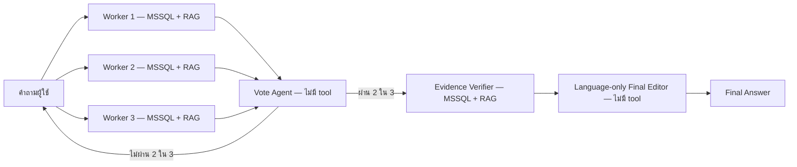

# Hybrid with Vote-Based Orchestration

Flow นี้รวม Concurrent Vote 2-of-3 กับ Evidence Verification โดยไม่แก้ทับ Flow เดิม

## Flow file

- [`LAB-hybrid-vote-2of3-verified-thai.json`](LAB-hybrid-vote-2of3-verified-thai.json)
- โปรแกรมสร้าง Flow: [`build_hybrid_vote_verified.mjs`](build_hybrid_vote_verified.mjs)
- Langflow: 1.7.3
- Flow ID ที่ติดตั้งใน Langflow: `5aa21611-7510-4e68-a8ab-5f72ec179550`

## Architecture

## กติกา retry

- Vote ไม่ผ่าน 2 ใน 3: ส่งคำถามเดิมให้ Workers ทั้งสามทำใหม่
- Vote ผ่าน: ไม่ย้อนกลับไปหา Workers เพียงเพราะ Verifier พบว่าหลักฐานไม่พอ
- MCP/tool ขัดข้องเป็นปัญหาทางเทคนิค ไม่ใช่การไม่ผ่าน vote; Flow นี้ไม่สร้างวง retry จาก Verifier

## กติกา 4 ข้อของ Evidence Verifier

1. มีหลักฐานตรง: คง claim ไว้
2. หลักฐานขัดแย้ง: แก้ claim ให้ตรงกับหลักฐาน
3. ไม่มีหลักฐาน: ตัด claim รอง; หากเป็น claim หลักให้ตอบว่าไม่สามารถยืนยันส่วนนั้นได้
4. ห้ามเติมคำตอบจากความรู้ของ Verifier เอง

ก่อนส่งคำตอบ Verifier ต้องไล่ตรวจทุก claim ทีละรายการ รวมถึงตัวเลข ผลรวม สูตร หน่วย label ขอบเขตประชากร และ business condition หากหลักฐานชัดเจนแต่ขัดกับ claim ต้องแก้ claim ให้ตรงกับหลักฐานและส่งต่อโดยไม่ retry หากหลักฐานกำกวมหรือขัดแย้งกันจึงระบุว่ายืนยันส่วนนั้นไม่ได้ จากนั้นทบทวนว่าทุก claim ที่เหลือมีหลักฐานรองรับและตอบสิ่งที่ผู้ใช้ถามครบเท่าที่หลักฐานรองรับ

ตัวอย่าง: Workers อย่างน้อย 2 ตัวตอบว่า `15,370.39 บาท` แต่ tool result มีเพียง `15370.39` และไม่มี currency metadata คำตอบผ่าน Vote ได้เพราะ Workers มีสาระตรงกัน แต่ Verifier ต้องตัดคำว่า `บาท` ออก

## ตำแหน่งของการตัดสินใจ

| Component | ต่อ tool | หน้าที่ |
|---|---:|---|
| Worker Agents 1–3 | MSSQL + RAG เหมือนกันทุกตัว | ค้นข้อมูลและตอบคำถามเดียวกันพร้อมกัน |
| Vote Agent | ไม่ต่อ | ตรวจว่าสาระสำคัญตรงกันอย่างน้อย 2 ใน 3 หรือไม่ |
| Pass or Retry | ไม่ต่อ | PASS ไป Verifier; RETRY กลับไป Workers |
| Evidence Verifier | MSSQL + RAG | รับคำถามเดิมกับคำตอบที่ผ่าน vote แล้วตรวจ แก้ ตัด หรือระบุว่ายืนยัน claim ไม่ได้ตามกติกา 4 ข้อ |
| Language-only Final Editor | ไม่ต่อ | เรียบเรียงภาษาไทยโดยห้ามเพิ่ม claim |

## โปรแกรมสร้าง Flow อยู่ตรงไหน

ไฟล์ `build_hybrid_vote_verified.mjs` ทำงานนอก Langflow ใช้อ่าน Concurrent Vote Flow และคัดลอกส่วน Verifier/Editor จาก Hybrid v1 แล้วเขียน Flow JSON ใหม่ ตัว JavaScript ไม่ถูกวางบน canvas และไม่ทำงานตอนผู้ใช้ถามคำถาม ส่วน prompts และ Python code ของ Custom Components ถูกบันทึกอยู่ใน JSON ที่อัปโหลดเข้า Langflow

## สิ่งที่ต้องทดสอบ

ใช้ Finance/Loan Grounded-18 ชุดเดิมอย่างน้อย 5 รอบ แล้วเปรียบเทียบกับ Concurrent Vote 5 รอบเดิมในด้าน:

- Correctness เฉลี่ยและช่วงคะแนน
- Faithfulness เฉลี่ยและช่วงคะแนน
- Final Answer availability
- เวลาเฉลี่ย
- การเกิด unsupported currency, approval interpretation และการตกหล่น business fields

## ผลตรวจเบื้องต้น

- Flow JSON มี 24 Components และ 31 เส้นเชื่อม
- Vote Agent ไม่มี tool edge
- Evidence Verifier มี tool edges 2 เส้น: MSSQL และ RAG
- Language-only Final Editor ไม่มี tool edge
- Smoke test Q1 ผ่านครบทั้ง Workers, Vote, Evidence Verifier, Final Editor และ Chat Output
- Evidence Verifier เรียก MSSQL ตรวจคำตอบซ้ำ และ Final Answer ไม่เติมสกุลเงิน
- API key อยู่เฉพาะใน Flow ที่ติดตั้งใน Langflow; ไฟล์ JSON ใน repo ไม่เก็บ key

## ผลทดสอบ Grounded-18 ทุกรอบ — 2026-08-08

ทุกแถวใช้คำถาม Finance/Loan Grounded-18 ชุดเดียวกัน ใช้ Verifier prompt เดียวกัน และให้คะแนนจาก Final Answer เท่านั้น จึงเปรียบเทียบกันเพื่อวัด non-determinism ได้โดยตรง

| รอบ | Verifier | Correctness | Faithfulness | Final Answer | เวลาเฉลี่ย | ผลทดสอบ |
|---|---|---:|---:|---:|---:|---|
| 1 | prompt ปัจจุบัน | **81/90** | **82/90** | **18/18** | **21.43s** | [รายงาน](evaluation-finance-loan-grounded18-current-prompt-run1-20260808.md) · [Raw](raw-finance-loan-grounded18-current-prompt-run1-20260808.jsonl) · [คะแนน](scores-finance-loan-grounded18-current-prompt-run1-20260808.json) |
| 2 | prompt ปัจจุบัน | 76/90 | 72/90 | **18/18** | 23.82s | [รายงาน](evaluation-finance-loan-grounded18-current-prompt-run2-20260808.md) · [Raw](raw-finance-loan-grounded18-current-prompt-run2-20260808.jsonl) · [คะแนน](scores-finance-loan-grounded18-current-prompt-run2-20260808.json) |
| 3 | prompt ปัจจุบัน | 78/90 | 75/90 | **18/18** | 22.65s | [รายงาน](evaluation-finance-loan-grounded18-current-prompt-run3-20260808.md) · [Raw](raw-finance-loan-grounded18-current-prompt-run3-20260808.jsonl) · [คะแนน](scores-finance-loan-grounded18-current-prompt-run3-20260808.json) |
| 4 | prompt ปัจจุบัน | 80/90 | 81/90 | **18/18** | 24.40s | [รายงาน](evaluation-finance-loan-grounded18-current-prompt-run4-20260808.md) · [Raw](raw-finance-loan-grounded18-current-prompt-run4-20260808.jsonl) · [คะแนน](scores-finance-loan-grounded18-current-prompt-run4-20260808.json) |
| 5 | prompt ปัจจุบัน | 80/90 | 81/90 | **18/18** | 23.99s | [รายงาน](evaluation-finance-loan-grounded18-current-prompt-run5-20260808.md) · [Raw](raw-finance-loan-grounded18-current-prompt-run5-20260808.jsonl) · [คะแนน](scores-finance-loan-grounded18-current-prompt-run5-20260808.json) |
| **เฉลี่ย 5 รอบ** | prompt ปัจจุบัน | **79.00/90** | **78.20/90** | **90/90** | **23.26s** | ช่วงคะแนน C 76–81, F 72–82 |

รอบ 1 ให้ผลดีที่สุด ส่วนรอบ 4 และ 5 ได้คะแนนรวมเท่ากัน แต่ข้อที่พลาดไม่เหมือนกันทั้งหมด ขณะที่รอบ 2–3 ลดลงจาก unsupported interpretation, invented currency และการ abstain ผิดบางข้อ แสดงว่า availability คงที่ แต่การกรอง claim ของ Verifier ยังมี non-deterministic behavior

## เปรียบเทียบกับ Concurrent Vote 2-of-3 — อย่างละ 5 รอบ

| Metric | Concurrent Vote | Hybrid Vote + Verifier |
|---|---:|---:|
| Correctness เฉลี่ย | 72.00/90 | **79.00/90** |
| Faithfulness เฉลี่ย | 76.80/90 | **78.20/90** |
| Final Answer | 89/90 | **90/90** |
| เวลาเฉลี่ย | **15.10s** | 23.26s |
| ช่วง Correctness | **69–73** | 76–81 |
| ช่วง Faithfulness | **73–80** | 72–82 |

Hybrid ให้คะแนนเฉลี่ยและ availability สูงกว่า แต่ไม่ได้ลดความแกว่งของคะแนน: SD Correctness เท่ากับ 1.79 เทียบกับ 1.55 และ SD Faithfulness เท่ากับ 3.97 เทียบกับ 2.79 ของ Concurrent Vote อีกทั้ง Hybrid ช้ากว่าเฉลี่ย 8.16 วินาทีต่อคำถาม

[ดูรายละเอียดการเปรียบเทียบ 5 รอบต่อ Flow](comparison-vs-concurrent-vote-5runs-20260808.md)
