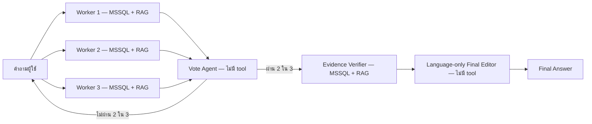

# Hybrid with Vote-Based Orchestration

Flow นี้รวม Concurrent Vote 2-of-3 กับ Evidence Verification โดยไม่แก้ทับ Flow เดิม

## Flow file

- [`LAB-hybrid-vote-2of3-verified-thai.json`](LAB-hybrid-vote-2of3-verified-thai.json)
- โปรแกรมสร้าง Flow: [`build_hybrid_vote_verified.mjs`](build_hybrid_vote_verified.mjs)
- Langflow: 1.7.3
- Flow ID ที่ติดตั้งใน Langflow: `5aa21611-7510-4e68-a8ab-5f72ec179550`

## Architecture

## กติกา retry

- Vote ไม่ผ่าน 2 ใน 3: ส่งคำถามเดิมให้ Workers ทั้งสามทำใหม่
- Vote ผ่าน: ไม่ย้อนกลับไปหา Workers เพียงเพราะ Verifier พบว่าหลักฐานไม่พอ
- MCP/tool ขัดข้องเป็นปัญหาทางเทคนิค ไม่ใช่การไม่ผ่าน vote; Flow นี้ไม่สร้างวง retry จาก Verifier

## กติกา 4 ข้อของ Evidence Verifier

1. มีหลักฐานตรง: คง claim ไว้
2. หลักฐานขัดแย้ง: แก้ claim ให้ตรงกับหลักฐาน
3. ไม่มีหลักฐาน: ตัด claim รอง; หากเป็น claim หลักให้ตอบว่าไม่สามารถยืนยันส่วนนั้นได้
4. ห้ามเติมคำตอบจากความรู้ของ Verifier เอง

ตัวอย่าง: Workers อย่างน้อย 2 ตัวตอบว่า `15,370.39 บาท` แต่ tool result มีเพียง `15370.39` และไม่มี currency metadata คำตอบผ่าน Vote ได้เพราะ Workers มีสาระตรงกัน แต่ Verifier ต้องตัดคำว่า `บาท` ออก

## ตำแหน่งของการตัดสินใจ

| Component | ต่อ tool | หน้าที่ |
|---|---:|---|
| Worker Agents 1–3 | MSSQL + RAG เหมือนกันทุกตัว | ค้นข้อมูลและตอบคำถามเดียวกันพร้อมกัน |
| Vote Agent | ไม่ต่อ | ตรวจว่าสาระสำคัญตรงกันอย่างน้อย 2 ใน 3 หรือไม่ |
| Pass or Retry | ไม่ต่อ | PASS ไป Verifier; RETRY กลับไป Workers |
| Evidence Verifier | MSSQL + RAG | รับคำถามเดิมกับคำตอบที่ผ่าน vote แล้วตรวจ แก้ ตัด หรือระบุว่ายืนยัน claim ไม่ได้ตามกติกา 4 ข้อ |
| Language-only Final Editor | ไม่ต่อ | เรียบเรียงภาษาไทยโดยห้ามเพิ่ม claim |

## โปรแกรมสร้าง Flow อยู่ตรงไหน

ไฟล์ `build_hybrid_vote_verified.mjs` ทำงานนอก Langflow ใช้อ่าน Concurrent Vote Flow และคัดลอกส่วน Verifier/Editor จาก Hybrid v1 แล้วเขียน Flow JSON ใหม่ ตัว JavaScript ไม่ถูกวางบน canvas และไม่ทำงานตอนผู้ใช้ถามคำถาม ส่วน prompts และ Python code ของ Custom Components ถูกบันทึกอยู่ใน JSON ที่อัปโหลดเข้า Langflow

## สิ่งที่ต้องทดสอบ

ใช้ Finance/Loan Grounded-18 ชุดเดิมอย่างน้อย 5 รอบ แล้วเปรียบเทียบกับ Concurrent Vote 5 รอบเดิมในด้าน:

- Correctness เฉลี่ยและช่วงคะแนน
- Faithfulness เฉลี่ยและช่วงคะแนน
- Final Answer availability
- เวลาเฉลี่ย
- การเกิด unsupported currency, approval interpretation และการตกหล่น business fields

## ผลตรวจเบื้องต้น

- Flow JSON มี 24 Components และ 31 เส้นเชื่อม
- Vote Agent ไม่มี tool edge
- Evidence Verifier มี tool edges 2 เส้น: MSSQL และ RAG
- Language-only Final Editor ไม่มี tool edge
- Smoke test Q1 ผ่านครบทั้ง Workers, Vote, Evidence Verifier, Final Editor และ Chat Output
- Evidence Verifier เรียก MSSQL ตรวจคำตอบซ้ำ และ Final Answer ไม่เติมสกุลเงิน
- API key อยู่เฉพาะใน Flow ที่ติดตั้งใน Langflow; ไฟล์ JSON ใน repo ไม่เก็บ key

## Grounded-18 run 1 — 2026-08-08

| Metric | Result |
|---|---:|
| Final Answer | 16/18 |
| Correctness | 66/90 |
| Faithfulness | 71/90 |
| Average latency | 30.82s |

รอบแรกยังด้อยกว่า Concurrent Vote baseline เฉลี่ย 5 รอบ Verifier ลด unsupported currency ได้หลายข้อ แต่ยังปล่อยตัวเลขผิด คำตอบไม่ครบ และ semantic interpretation บางจุด อีกทั้ง Q10/Q16 ไม่มี Final Answer จึงยังต้องยิงซ้ำก่อนประเมิน non-determinism

- [รายงานและคะแนนรายข้อ](evaluation-finance-loan-grounded18-run1-20260808.md)
- [Raw Final Answers](raw-finance-loan-grounded18-run1-20260808.jsonl)
- [คะแนน JSON](scores-finance-loan-grounded18-run1-20260808.json)
