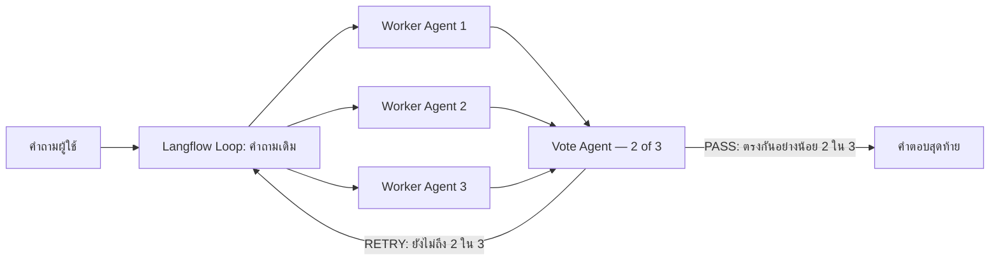
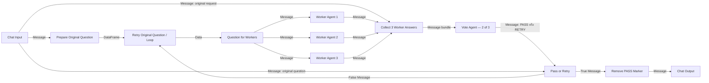

# Multi-Agent with Concurrent Orchestration

Flow นี้ทำงานตามกติกาง่าย ๆ:

1. ส่งคำถามเดียวกันให้ Worker Agents 3 ตัวทำงานพร้อมกัน
2. Worker ทั้งสามต่อ MSSQL MCP และ RAG MCP เหมือนกัน
3. Vote Agent ไม่ต่อ tool และอ่านเฉพาะคำถามกับคำตอบของ Workers
4. ถ้ามีคำตอบอย่างน้อย 2 ใน 3 ที่มีสาระสำคัญเหมือนกัน Vote Agent ส่งคำตอบสุดท้าย
5. ถ้ายังไม่ถึง 2 ใน 3 ระบบส่งคำถามเดิมกลับไปให้ Workers ทั้งสามทำใหม่



## Flow ที่เอกสารนี้อธิบาย

- Flow file: [`LAB-concurrent-vote-2of3-retry-thai.json`](LAB-concurrent-vote-2of3-retry-thai.json)
- Langflow: 1.7.3
- Builder: [`build_concurrent_vote_retry.mjs`](build_concurrent_vote_retry.mjs)
- ขอบเขตของหัวข้อนี้: อธิบายทุก component ยกเว้นรายละเอียดการตั้งค่า MCP Server

Flow file ถูกสร้างด้วย builder โดยนำ component พื้นฐานจาก Hybrid v1 มาเฉพาะส่วนที่ต้องใช้ แล้วเพิ่ม built-in `If-Else`, built-in `Loop` และ custom utility components สำหรับแปลงชนิดข้อมูล การสร้างผ่าน builder ช่วยรักษา node ID, `sourceHandle`/`targetHandle` ภายใน JSON และชนิดข้อมูลของ edge ให้ตรงกับ Langflow 1.7.3 มากกว่าการแก้ JSON ด้วยมือ

## สำหรับผู้อ่านที่ไม่เคยใช้ Langflow: วิธีอ่านชื่อและเส้นเชื่อม

ใน Langflow พื้นที่ที่ใช้วางและลากเส้นเชื่อมกล่องต่าง ๆ เรียกว่า **พื้นที่ทำงาน (canvas)** ส่วนกล่องแต่ละกล่องเรียกว่า **Component** เช่น `Chat Input`, `Worker Agent 1` และ `Collect 3 Worker Answers`

Component มี **port (จุดเชื่อมต่อ)** สองด้าน จากจุดนี้เป็นต้นไปเอกสารจะใช้คำว่า **port** อย่างสม่ำเสมอ:

- **Input port** คือจุดรับข้อมูลเข้า Component
- **Output port** คือจุดส่งผลลัพธ์ออกจาก Component
- เส้นเชื่อมหรือ **edge** แสดงว่าข้อมูลจาก output port ของ Component หนึ่งจะไหลไปยัง input port ของอีก Component หนึ่ง

เอกสารนี้เขียนชื่อ port ในรูปแบบ:

```text
ชื่อ Component.ชื่อ port
```

รูปแบบ `Component.port` อ่านว่า **“port ชื่อ `port` ของ Component ชื่อ `Component`”** เครื่องหมายจุด `.` มีไว้แบ่งชื่อ Component ออกจากชื่อ port เท่านั้น รูปแบบนี้เป็นเพียงวิธีเขียนย่อที่ README ใช้อธิบายเส้นเชื่อม ไม่ใช่รูปแบบคำสั่งของ Langflow และไม่ต้องพิมพ์ข้อความนี้ลงใน Langflow

ตัวอย่าง:

```text
Collect 3 Worker Answers.original_request
```

อ่านว่า:

- `Collect 3 Worker Answers` คือชื่อ Component บนพื้นที่ทำงาน
- `original_request` คือชื่อภายในของ input port
- ทั้งข้อความอ่านว่า “input port ชื่อ `original_request` ของ Component ชื่อ `Collect 3 Worker Answers`”

ดังนั้นข้อความต่อไปนี้:

```text
Chat Input.message
→ Collect 3 Worker Answers.original_request
```

หมายถึง:

1. หา Component ชื่อ `Chat Input`
2. เอาเม้าส์มาวางไว้ที่วงกลม output port ด้านขวาของ `Chat Input` จะมีกล่องข้อความเล็ก ๆ แสดงว่า `Output type: Message` จากนั้นกดค้างที่วงกลมดังกล่าว
3. ลากเส้นไปยัง Component ชื่อ `Collect 3 Worker Answers`
4. ปล่อยที่ input port ชื่อ `original_request`
5. ข้อมูลชนิด `Message` ซึ่งมีทั้งข้อความคำถามต้นฉบับและข้อมูลประกอบของข้อความ จะไหลตามเส้นจากซ้ายไปขวา

### ใครเป็นผู้ตั้งชื่อ port

- **Built-in Component:** ผู้พัฒนา Langflow กำหนดชื่อ port มาให้แล้ว ผู้ใช้เลือกและลากเส้นจาก port ที่มีอยู่
- **Custom Component:** ผู้เขียน Python component เป็นผู้กำหนดชื่อ port ใน code
- การลากเส้นบนพื้นที่ทำงานไม่ได้เป็นการตั้งชื่อ port ใหม่ แต่เป็นการเชื่อม port ที่ Component มีอยู่แล้ว

Custom component สามารถมีทั้งชื่อภายในและชื่อที่แสดงบน UI เช่น:

```python
MessageTextInput(
    name="original_request",
    display_name="Original Request",
)
```

- `name="original_request"` คือชื่อภายในที่ใช้ใน Flow JSON และวิธีเขียนย่อของ README
- `display_name="Original Request"` คือชื่ออ่านง่ายที่กำหนดไว้ให้หน้าจอ Langflow แต่จะปรากฏที่ใดหรือไม่ ขึ้นอยู่กับชนิด Component และการแสดงผลแบบย่อหรือแบบขยาย

ดังนั้นชื่อที่หน้าจอแสดงอาจเป็น **Original Request**, อาจแสดงเฉพาะชนิดข้อมูล หรืออาจไม่แสดงชื่อกำกับ port บนพื้นที่ทำงานเลย ขณะที่เอกสารเขียน `original_request` เพื่อให้ตรวจเทียบกับ JSON ได้ตรงกัน

### สิ่งที่เห็นจริงบนพื้นที่ทำงานอาจไม่มีชื่อ port

Component ที่แสดงแบบย่อ เช่น `Chat Input` จะแสดงเพียงวงกลม output port ด้านขวา ให้เอาเม้าส์มาวางไว้ที่วงกลมนั้น แล้ว Langflow 1.7.3 จะแสดงกล่องข้อความเล็ก ๆ ว่า:

```text
Output type: Message
Drag to connect compatible inputs
```

ในกรณีนี้ผู้ใช้ไม่ต้องค้นหาคำว่า `message` บนพื้นที่ทำงาน ให้สังเกต port จาก:

1. ตำแหน่ง — output port อยู่ด้านขวาของ Component
2. กล่องข้อความที่ปรากฏเมื่อเอาเม้าส์มาวางไว้ที่ port — แสดงชนิดข้อมูล `Message`
3. เส้นเดิม — หากมีการเชื่อมอยู่แล้วให้ดูเส้นที่ออกจากวงกลมนั้น

ชื่อภายใน `message` ใช้สำหรับอ่าน Flow JSON, โปรแกรมที่ใช้สร้าง Flow และตารางอ้างอิงใน README ไม่ใช่ชื่อกำกับที่รับประกันว่าจะมองเห็นบนพื้นที่ทำงาน

### วิธีอ่านลูกศรและชนิดข้อมูล

รูปแบบทั่วไปคือ:

```text
Source Component.output_port (ชนิดข้อมูล)
→ Target Component.input_port (ชนิดข้อมูลที่รับได้)
```

ตัวอย่าง:

```text
Question for Workers.result (Message)
→ Worker Agent 1.input_value (Message)
```

แปลว่า output port ชื่อ `result` ของ Component ชื่อ `Question for Workers` ส่งข้อมูลชนิด `Message` เข้า input port ชื่อ `input_value` ของ Component ชื่อ `Worker Agent 1`

คำที่ใช้ในเอกสารนี้:

- **ต้นทาง (Source)**: Component ที่ส่งข้อมูล
- **ปลายทาง (Target)**: Component ที่รับข้อมูล
- **ข้อมูลที่ส่ง (Payload)**: ตัวข้อมูลที่ไหลอยู่ในเส้น เช่น คำถามหรือคำตอบ
- **แยกออกหลายทาง (Fan-out)**: output เดียวเชื่อมไปหลาย Components เช่น ส่งคำถามเดียวกันให้ Workers สามตัว
- **รวมจากหลายทาง (Fan-in)**: หลาย outputs ไหลมารวมที่ Component เดียว เช่น คำตอบ Workers สามตัวไหลเข้า Collector
- **เส้นวนกลับ (Loop-back)**: เส้นที่ย้อนจาก Component ด้านหลังกลับไปยัง Component ก่อนหน้าเพื่อทำงานซ้ำ
- **Handle**: ชื่อทางเทคนิคที่พบเฉพาะใน Flow JSON ใช้ระบุว่าเส้นเชื่อมผูกกับ port ใด เช่น `sourceHandle` และ `targetHandle`; บนพื้นที่ทำงานให้เรียกว่า port

### ชนิดข้อมูลหลักที่พบใน Flow

| ชนิด | ความหมายแบบง่าย | ตัวอย่างใน Flow |
|---|---|---|
| `Message` | ข้อความสนทนาพร้อมข้อมูลประกอบ เช่น ผู้ส่งและเวลา | คำถามผู้ใช้และคำตอบ Agent |
| `Data` | ข้อมูลหนึ่งรายการที่ไม่จำเป็นต้องเป็นข้อความสนทนา | คำถามหนึ่งรายการที่ออกจาก Loop |
| `DataFrame` | กลุ่มของ `Data` หลายรายการ | รายการคำถามที่เตรียมให้ Loop |

Langflow จะยอมให้ลากเส้นได้เมื่อชนิด output และ input เข้ากัน หากชนิดไม่เข้ากัน เส้นอาจลากไม่ได้หรือถูกลบเมื่อนำเข้า Flow

## ภาพรวม Component และชนิดข้อมูล



## วิธีสร้างและตั้งค่าแต่ละ Component

### 1. Chat Input

ชนิด: built-in `Chat Input` จากหมวด **Input & Output**

วิธีสร้าง:

1. ลาก `Chat Input` ลงบนพื้นที่ทำงาน
2. ตั้ง `Sender = User` และ `Sender Name = User`
3. เปิด `Store Messages` หากต้องการเก็บประวัติใน Langflow; Flow file นี้ตั้งเป็น `true`

output port ที่ใช้มีชื่อภายในว่า `message` และส่งข้อมูลชนิด `Message` โดยลากออกสามทาง:

เมื่อ Component แสดงแบบย่อ จะเห็นเป็นวงกลม output port ด้านขวาของ `Chat Input` ให้เอาเม้าส์มาวางไว้ที่วงกลม แล้วจะเห็นกล่องข้อความ `Output type: Message`; คำว่า `message` เป็นชื่อภายใน JSON จึงอาจไม่ปรากฏบนพื้นที่ทำงาน

- ไป `Prepare Original Question.original_question` เพื่อเริ่มเส้นทางทำงานของ Workers
- ไป `Collect 3 Worker Answers.original_request` เพื่อให้ Vote Agent เห็นคำถามต้นฉบับ
- ไป `Pass or Retry.false_case_message` เพื่อให้ทางออก RETRY ส่งคำถามเดิมกลับเข้า Loop

ข้อมูลที่ไหลคือข้อความคำถามของผู้ใช้พร้อมข้อมูลประกอบของ `Message` เช่น ผู้ส่งและเวลา ไม่ใช่ข้อความธรรมดาเพียงอย่างเดียว

### 2. Prepare Original Question

ชนิด: custom component `RetryQuestionSeed` ชื่อบนพื้นที่ทำงานว่า `Prepare Original Question`

วิธีสร้าง:

1. กด **New Custom Component**
2. ใช้ class `RetryQuestionSeed` จากส่วน `seedCode` ใน [`build_concurrent_vote_retry.mjs`](build_concurrent_vote_retry.mjs)
3. Component รับ `original_question` ด้วย `MessageTextInput`
4. Component คืน `result` เป็น `DataFrame`

หน้าที่คืออ่านข้อความต้นฉบับจาก `Message` แล้วสร้าง `DataFrame` ที่มี `Data(text=<คำถามเดิม>)` สำหรับป้อน built-in Loop ใน Flow นี้เตรียมไว้สูงสุด 1,000 รายการ เพื่อให้ Loop มี item สำหรับการทำงานรอบถัดไป โดยไม่ได้เปลี่ยนเนื้อหาคำถาม

ลากเส้น:

- `Chat Input.message (Message)` → `Prepare Original Question.original_question (Message)`
- `Prepare Original Question.result (DataFrame)` → `Retry Original Question.data (DataFrame)`

### 3. Retry Original Question

ชนิด: built-in `LoopComponent` จากหมวด **Flow Control** ชื่อบนพื้นที่ทำงานว่า `Retry Original Question`

วิธีสร้างและตั้งค่า:

1. ลาก `Loop` ลงบนพื้นที่ทำงาน
2. ไม่ต้องแก้ Python code ของ built-in component
3. ต่อ `Prepare Original Question.result` เข้า input port ชื่อภายใน `data` ซึ่งมี `display_name` ว่า `Inputs`
4. ใช้ output port ชื่อภายใน `item` ซึ่งมี `display_name` ว่า `Item` เป็นข้อมูลของรอบปัจจุบัน

ชนิดข้อมูล:

- Input `data`: `DataFrame`
- Output `item`: `Data`
- Loop-back target `item`: รับ `Message` จากเส้น RETRY ได้ตาม `loop_types` ของ Langflow

ลากเส้น:

- `Prepare Original Question.result (DataFrame)` → `Retry Original Question.data (DataFrame)`
- `Retry Original Question.item (Data)` → `Question for Workers.item (Data)`
- `Pass or Retry.false_result (Message)` → loop-back port `Retry Original Question.item (Data | Message)`

เส้นสุดท้ายต้องลากกลับเข้าที่ port `item` ของ Loop ไม่ใช่ input port `data` ปกติ หากสร้าง edge JSON เอง `targetHandle` ซึ่งเป็นข้อมูลภายใน JSON ต้องประกาศ `output_types = ["Data", "Message"]`; มิฉะนั้น Langflow 1.7.3 จะลบเส้นและแสดง `Some connections were removed because they were invalid`

### 4. Question for Workers

ชนิด: custom component `RetryQuestionMessage` ชื่อบนพื้นที่ทำงานว่า `Question for Workers`

วิธีสร้าง:

1. กด **New Custom Component**
2. ใช้ class `RetryQuestionMessage` จากส่วน `dataToMessageCode` ใน builder
3. กำหนด input port ชื่อ `item` เป็น `DataInput`
4. กำหนด output port ชื่อ `result` เป็น `Message`

หน้าที่คืออ่าน `Data.text` จาก Loop แล้วแปลงกลับเป็น `Message(text=...)` เพราะ Agent รับคำถามผ่าน `input_value` ชนิด `Message`

ลากเส้นแบบแยกออกสามทาง:

- `Retry Original Question.item (Data)` → `Question for Workers.item (Data)`
- `Question for Workers.result (Message)` → `Worker Agent 1.input_value (Message)`
- `Question for Workers.result (Message)` → `Worker Agent 2.input_value (Message)`
- `Question for Workers.result (Message)` → `Worker Agent 3.input_value (Message)`

เมื่อ `Message` เดียวกันไปถึงเส้นทางทั้งสาม Langflow สามารถเริ่ม Worker ทั้งสามพร้อมกัน โดย Worker ตัวหนึ่งไม่ต้องรอคำตอบของอีกตัว นี่คือส่วนที่ทำงานพร้อมกันของ Flow

### 5. Worker Agent 1, 2 และ 3

ชนิด: built-in `Agent` จากหมวด **Models & Agents** จำนวนสามตัว

ค่าที่เหมือนกัน:

| รายการ | ค่าที่ตั้งไว้ |
|---|---|
| Model Provider | OpenAI-compatible |
| Model Name | `qwen/qwen3.5-35b-a3b` |
| API Base | `https://openrouter.ai/api/v1` |
| Temperature | `0.2` |
| Max Retries | `5` |
| Timeout | `700` |
| Max Iterations | `41` |
| Add Current Date Tool | `false` |

ค่าที่ต่างกันมีเฉพาะ seed เพื่อให้ Workers ทำงานอิสระ:

- Worker 1: `seed = 101`
- Worker 2: `seed = 202`
- Worker 3: `seed = 303`

คำสั่งประจำ Agent ของทั้งสามตัวกำหนดเหมือนกันว่าให้ตอบคำถามเดียวกันอย่างอิสระ ใช้หลักฐานจริง รักษาตัวเลข สูตร หน่วย ชื่อกำกับ ขอบเขตประชากร และเงื่อนไขทางธุรกิจ ห้ามดูคำตอบของ Worker ตัวอื่น และตอบภาษาไทยเป็นหลัก

การเชื่อมต่อข้อมูลที่ไม่ใช่ MCP:

- `Question for Workers.result (Message)` → `Worker Agent N.input_value (Message)`
- `Worker Agent N.response (Message)` → `Collect 3 Worker Answers.candidate_N (Message)`

แต่ละ Worker มี tool input ของตนเองเหมือนกันทุกตัว แต่ไม่มีเส้นเชื่อมระหว่าง Workers

### 6. Collect 3 Worker Answers

ชนิด: custom component `RawAnswerCollector`

วิธีสร้าง:

1. กด **New Custom Component**
2. ใช้ component definition ที่อยู่ใน Flow file/builder
3. สร้าง input port ชนิด `Message` จำนวนสี่รายการ: `original_request`, `candidate_1`, `candidate_2`, `candidate_3`
4. สร้าง output port ชื่อ `result` ชนิด `Message`

หน้าที่คือรอรับให้ครบทั้งคำถามเดิมและคำตอบจาก Worker สามตัว แล้วรวมเป็นข้อความชุดเดียว โดยไม่ลงคะแนน ไม่แยกวิเคราะห์ JSON และไม่แก้ข้อความยืนยันข้อเท็จจริง (claim)

ลากเส้น:

- `Chat Input.message` → `original_request`
- `Worker Agent 1.response` → `candidate_1`
- `Worker Agent 2.response` → `candidate_2`
- `Worker Agent 3.response` → `candidate_3`
- `Collect 3 Worker Answers.result (Message)` → `Vote Agent.input_value (Message)`

ข้อมูลใน output เป็น `Message` ที่มีคำถามต้นฉบับและคำตอบทั้งสามชุด เพื่อให้ Vote Agent ได้รับข้อมูลทั้งหมดพร้อมกันในการทำงานหนึ่งครั้ง

### 7. Vote Agent — 2 of 3

ชนิด: built-in `Agent` แต่ **ไม่ต่อ tool ใด ๆ**

ค่าที่ตั้งไว้:

| รายการ | ค่าที่ตั้งไว้ |
|---|---|
| Model | `qwen/qwen3.5-35b-a3b` ผ่าน OpenRouter |
| Temperature | `0` |
| Seed | `1` |
| Max Retries | `5` |
| Timeout | `700` |
| Max Iterations | `41` |
| Tools | ว่าง |

Agent Instructions กำหนดให้ตรวจว่าคำตอบอย่างน้อย 2 ใน 3 มีสาระสำคัญเหมือนกันหรือไม่ โดยไม่บังคับให้ใช้คำหรือประโยคเหมือนกัน:

- ผ่าน: คืน `Message` ที่บรรทัดแรกเป็น `PASS` และตามด้วยคำตอบจากสาระที่ตรงกัน
- ไม่ผ่าน: คืน `Message` ที่มีคำเดียวว่า `RETRY`

ห้าม Vote Agent เรียก tool, ตอบโจทย์ด้วยความรู้ของตนเอง หรือเพิ่มข้อเท็จจริงใหม่

ลากเส้น:

- `Collect 3 Worker Answers.result (Message)` → `Vote Agent.input_value (Message)`
- `Vote Agent.response (Message)` → `Pass or Retry.input_text (Message)`
- `Vote Agent.response (Message)` → `Pass or Retry.true_case_message (Message)`

เส้นแรกใช้ตัดสินเงื่อนไข ส่วนเส้นที่สองส่งตัวคำตอบต่อไปเมื่อผ่าน

### 8. Pass or Retry

ชนิด: built-in `If-Else` หรือ `ConditionalRouter` จากหมวด **Flow Control**

ค่าที่ตั้งไว้:

| รายการ | ค่าที่ตั้งไว้ |
|---|---|
| Operator | `starts with` |
| Match Text | `PASS` |
| Case Sensitive | `true` |
| Default Route | `false_result` |
| Max Iterations | `1000` |

Inputs มีสามเส้น:

- `Vote Agent.response` → `input_text`: ข้อความที่ใช้ตรวจว่าขึ้นต้นด้วย `PASS` หรือไม่
- `Vote Agent.response` → `true_case_message`: ตัวคำตอบที่ส่งต่อเมื่อเงื่อนไขเป็นจริง
- `Chat Input.message` → `false_case_message`: คำถามต้นฉบับที่ส่งต่อเมื่อเงื่อนไขเป็นเท็จ

Outputs:

- `true_result (Message)` → `Remove PASS Marker.approved_answer`
- `false_result (Message)` → loop-back port `Retry Original Question.item`

ดังนั้น router ไม่ได้สร้างคำตอบใหม่ เพียงเลือกว่าจะส่ง Vote response ไป Chat Output หรือส่งคำถามเดิมกลับเข้า Loop

### 9. Remove PASS Marker

ชนิด: custom component `StripPassMarker`

วิธีสร้าง:

1. กด **New Custom Component**
2. ใช้ class `StripPassMarker` จากส่วน `stripCode` ใน builder
3. Input `approved_answer` เป็น `MessageTextInput`
4. Output `result` เป็น `Message`

หน้าที่มีเพียงลบคำควบคุมเส้นทาง `PASS` รวมถึงการขึ้นบรรทัดใหม่หรือเครื่องหมายทวิภาค (`:`) ที่ตามหลังออกจากต้นข้อความ ไม่ตรวจความถูกต้อง ไม่คำนวณ ไม่แก้เนื้อหา และไม่เพิ่มข้อความยืนยันข้อเท็จจริงใหม่

ลากเส้น:

- `Pass or Retry.true_result (Message)` → `Remove PASS Marker.approved_answer (Message)`
- `Remove PASS Marker.result (Message)` → `Chat Output.input_value (Message)`

### 10. Chat Output

ชนิด: built-in `Chat Output` จากหมวด **Input & Output**

ค่าที่ตั้งไว้ใน Flow file:

- `Sender = Machine`
- `Sender Name = AI`
- `Store Messages = true`
- `Clean Data = true`

รับ `Message` จาก `Remove PASS Marker.result` แล้วแสดง Final Answer ภาษาไทยใน Playground/API output ไม่มีเส้นจาก Worker หรือ Vote Agent เข้า Chat Output โดยตรง

## ตารางเส้นเชื่อมที่ไม่รวม MCP

| # | Source output | ชนิด | Target input | ชนิด | ความหมาย |
|---:|---|---|---|---|---|
| 1 | Chat Input.message | Message | Prepare Original Question.original_question | Message | คำถามเดิมเข้าสู่เส้นทาง Worker |
| 2 | Prepare Original Question.result | DataFrame | Retry Original Question.data | DataFrame | เตรียมรายการสำหรับ Loop |
| 3 | Retry Original Question.item | Data | Question for Workers.item | Data | item ของรอบปัจจุบัน |
| 4–6 | Question for Workers.result | Message | Worker Agent 1–3.input_value | Message | แยกคำถามเดียวกันไปยัง Workers สามตัว |
| 7 | Chat Input.message | Message | Collect 3 Worker Answers.original_request | Message | เก็บโจทย์เดิมไว้ใน vote bundle |
| 8–10 | Worker Agent 1–3.response | Message | Collect 3 Worker Answers.candidate_1–3 | Message | รวมคำตอบสามชุดเข้าสู่ Component เดียว |
| 11 | Collect 3 Worker Answers.result | Message | Vote Agent.input_value | Message | bundle สำหรับ vote |
| 12 | Vote Agent.response | Message | Pass or Retry.input_text | Message | ข้อความสำหรับตรวจ PASS |
| 13 | Vote Agent.response | Message | Pass or Retry.true_case_message | Message | ตัวคำตอบที่ส่งต่อเมื่อผ่าน |
| 14 | Chat Input.message | Message | Pass or Retry.false_case_message | Message | คำถามเดิมที่ส่งต่อเมื่อไม่ผ่าน |
| 15 | Pass or Retry.true_result | Message | Remove PASS Marker.approved_answer | Message | คำตอบที่ผ่าน vote |
| 16 | Remove PASS Marker.result | Message | Chat Output.input_value | Message | คำตอบสุดท้ายที่ลบคำควบคุม `PASS` แล้ว |
| 17 | Pass or Retry.false_result | Message | Retry Original Question.item | Data/Message loop port | ส่งคำถามเดิมกลับเข้า Loop |

## ทิศทางการไหลของข้อมูล

1. `Message` จาก Chat Input ถูกเก็บเป็น original request และถูกแปลงเป็น `DataFrame` สำหรับ Loop
2. Loop ปล่อย `Data` หนึ่ง item แล้ว utility แปลงเป็น `Message`
3. `Message` เดียวกันแยกออกสามทางไปยัง Worker Agents พร้อมกัน
4. คำตอบ `Message` สามชุดรวมกลับเป็น `Message bundle`
5. Vote Agent คืน `Message` ที่เป็น PASS พร้อมคำตอบ หรือ RETRY
6. If-Else ส่ง PASS ไปทาง Chat Output หรือส่ง original-question `Message` กลับเข้า Loop
7. ทาง PASS ลบเฉพาะคำควบคุม `PASS` แล้วจึงแสดงคำตอบสุดท้าย

Flow นี้ไม่มีข้อบังคับเรื่องโครงสร้าง JSON, ตัวแยกวิเคราะห์ JSON, Agent ตรวจหลักฐาน หรือด่านตรวจคำตอบสุดท้าย การตัดสินใจมีเพียง Vote Agent ว่าสาระสำคัญตรงกันอย่างน้อย 2 ใน 3 หรือไม่

## ไฟล์

- `LAB-concurrent-vote-2of3-retry-thai.json` — ไฟล์สำหรับ Upload a flow ใน Langflow 1.7.3
- `build_concurrent_vote_retry.mjs` — builder ที่สร้าง Flow จาก Hybrid v1 โดยตัด Verifier, Final Editor และส่วนอื่นที่ไม่อยู่ใน design นี้ออก

`Remove PASS Marker` เป็น Component ช่วยจัดเส้นทาง โดยลบคำว่า `PASS` ก่อนส่งเข้า Chat Output เท่านั้น ไม่ตรวจ แก้ หรือเพิ่มสาระของคำตอบ

จุดวนกลับใช้ `LoopComponent` มาตรฐานของ Langflow 1.7.3 โดยตรง เพื่อให้เส้น `RETRY → Loop` ไม่ถูกหน้าจอ Langflow ลบทิ้ง ส่วน `Prepare Original Question` และ `Question for Workers` มีหน้าที่แปลงชนิดข้อมูลเข้า–ออกจาก Loop เท่านั้น ไม่ลงคะแนน ไม่แก้คำตอบ และไม่ทำหน้าที่แทน Agent

## ผลตรวจล่าสุด

- หน้า Langflow แสดงเส้น `False/RETRY → Retry Original Question` และไม่ขึ้นข้อความ invalid connection
- Runtime smoke test ผ่าน HTTP 200 และส่งคำตอบออก Chat Output ได้
- Worker Agent แต่ละตัวมีเส้นเชื่อมไปยัง MCP tools 2 เส้น: MSSQL และ RAG
- Vote Agent ไม่มีเส้นเชื่อมไปยัง tool
- ไฟล์ JSON ใน repo ไม่บันทึก API key; key อยู่เฉพาะใน flow ที่ติดตั้งใน Langflow
