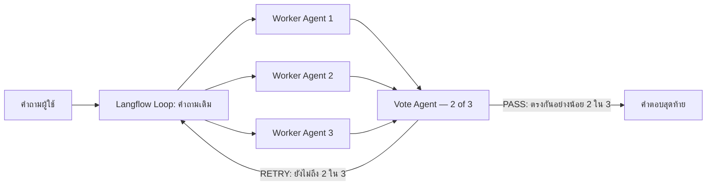

# Multi-Agent with Concurrent Orchestration

Flow นี้ทำงานตามกติกาง่าย ๆ:

1. ส่งคำถามเดียวกันให้ Worker Agents 3 ตัวทำงานพร้อมกัน
2. Worker ทั้งสามต่อ MSSQL MCP และ RAG MCP เหมือนกัน
3. Vote Agent ไม่ต่อ tool และอ่านเฉพาะคำถามกับคำตอบของ Workers
4. ถ้ามีคำตอบอย่างน้อย 2 ใน 3 ที่มีสาระสำคัญเหมือนกัน Vote Agent ส่งคำตอบสุดท้าย
5. ถ้ายังไม่ถึง 2 ใน 3 ระบบส่งคำถามเดิมกลับไปให้ Workers ทั้งสามทำใหม่

## ไฟล์

- `LAB-concurrent-vote-2of3-retry-thai.json` — ไฟล์สำหรับ Upload a flow ใน Langflow 1.7.3
- `build_concurrent_vote_retry.mjs` — builder ที่สร้าง Flow จาก Hybrid v1 โดยตัด Verifier, Final Editor และส่วนอื่นที่ไม่อยู่ใน design นี้ออก

`Remove PASS Marker` เป็น routing utility ที่ลบคำว่า `PASS` ก่อน Chat Output เท่านั้น ไม่ตรวจ แก้ หรือเพิ่มสาระของคำตอบ

จุดวนกลับใช้ `LoopComponent` มาตรฐานของ Langflow 1.7.3 โดยตรง เพื่อให้เส้น `RETRY → Loop` ไม่ถูกหน้า UI ลบทิ้ง ส่วน `Prepare Original Question` และ `Question for Workers` มีหน้าที่แปลงชนิดข้อมูลเข้า–ออกจาก Loop เท่านั้น ไม่ลงคะแนน ไม่แก้คำตอบ และไม่ทำหน้าที่แทน Agent

## ผลตรวจล่าสุด

- หน้า Langflow แสดงเส้น `False/RETRY → Retry Original Question` และไม่ขึ้นข้อความ invalid connection
- Runtime smoke test ผ่าน HTTP 200 และส่งคำตอบออก Chat Output ได้
- Worker Agent แต่ละตัวมี MCP tool edges 2 เส้น: MSSQL และ RAG
- Vote Agent มี tool edges 0 เส้น
- ไฟล์ JSON ใน repo ไม่บันทึก API key; key อยู่เฉพาะใน flow ที่ติดตั้งใน Langflow
