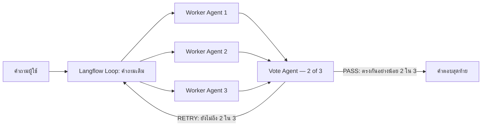
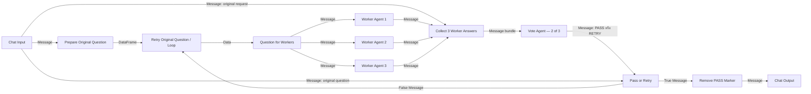

# Multi-Agent with Concurrent Orchestration

Flow นี้ทำงานตามกติกาง่าย ๆ:

1. ส่งคำถามเดียวกันให้ Worker Agents 3 ตัวทำงานพร้อมกัน
2. Worker ทั้งสามต่อ MSSQL MCP และ RAG MCP เหมือนกัน
3. Vote Agent ไม่ต่อ tool และอ่านเฉพาะคำถามกับคำตอบของ Workers
4. ถ้ามีคำตอบอย่างน้อย 2 ใน 3 ที่มีสาระสำคัญเหมือนกัน Vote Agent ส่งคำตอบสุดท้าย
5. ถ้ายังไม่ถึง 2 ใน 3 ระบบส่งคำถามเดิมกลับไปให้ Workers ทั้งสามทำใหม่



## Flow ที่เอกสารนี้อธิบาย

- Flow file: [`LAB-concurrent-vote-2of3-retry-thai.json`](LAB-concurrent-vote-2of3-retry-thai.json)
- Langflow: 1.7.3
- Builder: [`build_concurrent_vote_retry.mjs`](build_concurrent_vote_retry.mjs)
- ขอบเขตของหัวข้อนี้: อธิบายทุก component ยกเว้นรายละเอียดการตั้งค่า MCP Server

Flow file ถูกสร้างด้วย builder โดยนำ component พื้นฐานจาก Hybrid v1 มาเฉพาะส่วนที่ต้องใช้ แล้วเพิ่ม built-in `If-Else`, built-in `Loop` และ custom utility components สำหรับแปลงชนิดข้อมูล การสร้างผ่าน builder ช่วยรักษา node ID, `sourceHandle`/`targetHandle` ภายใน JSON และชนิดข้อมูลของ edge ให้ตรงกับ Langflow 1.7.3 มากกว่าการแก้ JSON ด้วยมือ

## สำหรับผู้อ่านที่ไม่เคยใช้ Langflow: วิธีอ่านชื่อและเส้นเชื่อม

ใน Langflow กล่องแต่ละกล่องบน canvas เรียกว่า **Component** เช่น `Chat Input`, `Worker Agent 1` และ `Collect 3 Worker Answers`

Component มี **port (จุดเชื่อมต่อ)** สองด้าน จากจุดนี้เป็นต้นไปเอกสารจะใช้คำว่า **port** อย่างสม่ำเสมอ:

- **Input port** คือจุดรับข้อมูลเข้า Component
- **Output port** คือจุดส่งผลลัพธ์ออกจาก Component
- เส้นเชื่อมหรือ **edge** แสดงว่าข้อมูลจาก output port ของ Component หนึ่งจะไหลไปยัง input port ของอีก Component หนึ่ง

เอกสารนี้เขียนชื่อ port ในรูปแบบ:

```text
ชื่อ Component.ชื่อ port
```

เครื่องหมายจุด `.` อ่านว่า **“port ของ”** ใช้เพื่อแบ่งชื่อ Component ออกจากชื่อ port เท่านั้น ไม่ใช่คำสั่งหรือ operator ของ Langflow

ตัวอย่าง:

```text
Collect 3 Worker Answers.original_request
```

อ่านว่า:

- `Collect 3 Worker Answers` คือชื่อ Component บน canvas
- `original_request` คือชื่อ input port ภายใน Component นั้น
- `.` หมายถึง “input port `original_request` ของ Component `Collect 3 Worker Answers`”

ดังนั้นข้อความต่อไปนี้:

```text
Chat Input.message
→ Collect 3 Worker Answers.original_request
```

หมายถึง:

1. หา Component ชื่อ `Chat Input`
2. จับจุด output ชื่อ `message`
3. ลากเส้นไปยัง Component ชื่อ `Collect 3 Worker Answers`
4. ปล่อยที่ input ชื่อ `original_request`
5. ข้อมูลชนิด `Message` ซึ่งมีคำถามต้นฉบับของผู้ใช้จะไหลตามลูกศรจากซ้ายไปขวา

ชื่อที่เห็นบนหน้าจออาจเป็นคำอ่านง่าย เช่น **Original Request** แต่ชื่อภายใน Flow JSON เป็น `original_request` เอกสารนี้ใช้ชื่อภายในเพื่อให้ตรวจเทียบกับไฟล์ JSON ได้ตรงกัน

### วิธีอ่านลูกศรและชนิดข้อมูล

รูปแบบทั่วไปคือ:

```text
Source Component.output_port (ชนิดข้อมูล)
→ Target Component.input_port (ชนิดข้อมูลที่รับได้)
```

ตัวอย่าง:

```text
Question for Workers.result (Message)
→ Worker Agent 1.input_value (Message)
```

แปลว่า output `result` ของ `Question for Workers` ส่งข้อมูลชนิด `Message` เข้า input `input_value` ของ `Worker Agent 1`

คำที่ใช้ในเอกสารนี้:

- **Source**: Component ต้นทางที่ส่งข้อมูล
- **Target**: Component ปลายทางที่รับข้อมูล
- **Payload**: ตัวข้อมูลที่วิ่งอยู่ในเส้น เช่นคำถามหรือคำตอบ
- **Fan-out**: output เดียวลากไปหลาย Components เช่นส่งคำถามเดียวกันให้ Workers สามตัว
- **Fan-in**: หลาย outputs ไหลมารวมที่ Component เดียว เช่นคำตอบ Workers สามตัวไหลเข้า Collector
- **Loop-back**: เส้นที่ย้อนจาก Component ด้านหลังกลับไปยัง Component ก่อนหน้าเพื่อทำงานซ้ำ
- **Handle**: คำที่ใช้เฉพาะเมื่อกล่าวถึงข้อมูลภายใน Flow JSON ซึ่งระบุว่า edge ผูกกับ port ใด เช่น `sourceHandle` และ `targetHandle`; บนหน้า canvas ให้เรียกว่า port

### ชนิดข้อมูลหลักที่พบใน Flow

| ชนิด | ความหมายแบบง่าย | ตัวอย่างใน Flow |
|---|---|---|
| `Message` | ข้อความสนทนาพร้อม metadata | คำถามผู้ใช้และคำตอบ Agent |
| `Data` | ข้อมูลหนึ่งรายการที่ไม่จำเป็นต้องเป็นข้อความสนทนา | คำถามหนึ่งรายการที่ออกจาก Loop |
| `DataFrame` | กลุ่มของ `Data` หลายรายการ | รายการคำถามที่เตรียมให้ Loop |

Langflow จะยอมให้ลากเส้นได้เมื่อชนิด output และ input เข้ากัน หากชนิดไม่เข้ากัน เส้นอาจลากไม่ได้หรือถูกลบเมื่อนำเข้า Flow

## ภาพรวม Component และชนิดข้อมูล



## วิธีสร้างและ Configure แต่ละ Component

### 1. Chat Input

ชนิด: built-in `Chat Input` จากหมวด **Input & Output**

วิธีสร้าง:

1. ลาก `Chat Input` ลงบน canvas
2. ตั้ง `Sender = User` และ `Sender Name = User`
3. เปิด `Store Messages` หากต้องการเก็บประวัติใน Langflow; Flow file นี้ตั้งเป็น `true`

Output ที่ใช้คือ `message` ชนิด `Message` โดยลากออกสามทาง:

- ไป `Prepare Original Question.original_question` เพื่อเริ่มเส้นทางทำงานของ Workers
- ไป `Collect 3 Worker Answers.original_request` เพื่อให้ Vote Agent เห็นคำถามต้นฉบับ
- ไป `Pass or Retry.false_case_message` เพื่อให้ทางออก RETRY ส่งคำถามเดิมกลับเข้า Loop

ข้อมูลที่ไหลคือข้อความคำถามของผู้ใช้พร้อม metadata ของ `Message` ไม่ใช่ string เปล่า

### 2. Prepare Original Question

ชนิด: custom component `RetryQuestionSeed` ชื่อบน canvas ว่า `Prepare Original Question`

วิธีสร้าง:

1. กด **New Custom Component**
2. ใช้ class `RetryQuestionSeed` จากส่วน `seedCode` ใน [`build_concurrent_vote_retry.mjs`](build_concurrent_vote_retry.mjs)
3. Component รับ `original_question` ด้วย `MessageTextInput`
4. Component คืน `result` เป็น `DataFrame`

หน้าที่คืออ่านข้อความต้นฉบับจาก `Message` แล้วสร้าง `DataFrame` ที่มี `Data(text=<คำถามเดิม>)` สำหรับป้อน built-in Loop ใน Flow นี้เตรียมไว้สูงสุด 1,000 รายการ เพื่อให้ Loop มี item สำหรับการทำงานรอบถัดไป โดยไม่ได้เปลี่ยนเนื้อหาคำถาม

ลากเส้น:

- `Chat Input.message (Message)` → `Prepare Original Question.original_question (Message)`
- `Prepare Original Question.result (DataFrame)` → `Retry Original Question.data (DataFrame)`

### 3. Retry Original Question

ชนิด: built-in `LoopComponent` จากหมวด **Flow Control** ชื่อบน canvas ว่า `Retry Original Question`

วิธีสร้างและตั้งค่า:

1. ลาก `Loop` ลงบน canvas
2. ไม่ต้องแก้ Python code ของ built-in component
3. ต่อ `Prepare Original Question.result` เข้า input port `Inputs/data`
4. ใช้ output `Item/item` เป็นข้อมูลของรอบปัจจุบัน

ชนิดข้อมูล:

- Input `data`: `DataFrame`
- Output `item`: `Data`
- Loop-back target `item`: รับ `Message` จากเส้น RETRY ได้ตาม `loop_types` ของ Langflow

ลากเส้น:

- `Prepare Original Question.result (DataFrame)` → `Retry Original Question.data (DataFrame)`
- `Retry Original Question.item (Data)` → `Question for Workers.item (Data)`
- `Pass or Retry.false_result (Message)` → loop-back port `Retry Original Question.item (Data | Message)`

เส้นสุดท้ายต้องลากกลับเข้าที่ port `item` ของ Loop ไม่ใช่ input port `data` ปกติ หากสร้าง edge JSON เอง `targetHandle` ซึ่งเป็นข้อมูลภายใน JSON ต้องประกาศ `output_types = ["Data", "Message"]`; มิฉะนั้น Langflow 1.7.3 จะลบเส้นและแสดง `Some connections were removed because they were invalid`

### 4. Question for Workers

ชนิด: custom component `RetryQuestionMessage` ชื่อบน canvas ว่า `Question for Workers`

วิธีสร้าง:

1. กด **New Custom Component**
2. ใช้ class `RetryQuestionMessage` จากส่วน `dataToMessageCode` ใน builder
3. กำหนด input `item` เป็น `DataInput`
4. กำหนด output `result` เป็น `Message`

หน้าที่คืออ่าน `Data.text` จาก Loop แล้วแปลงกลับเป็น `Message(text=...)` เพราะ Agent รับคำถามผ่าน `input_value` ชนิด `Message`

ลากเส้นแบบ fan-out:

- `Retry Original Question.item (Data)` → `Question for Workers.item (Data)`
- `Question for Workers.result (Message)` → `Worker Agent 1.input_value (Message)`
- `Question for Workers.result (Message)` → `Worker Agent 2.input_value (Message)`
- `Question for Workers.result (Message)` → `Worker Agent 3.input_value (Message)`

เมื่อ `Message` เดียวกันพร้อมที่ทั้งสาม branch Langflow สามารถ schedule Worker ทั้งสามโดยไม่ต้องรอคำตอบของ Worker ตัวอื่น จึงเป็นส่วน concurrent ของ Flow

### 5. Worker Agent 1, 2 และ 3

ชนิด: built-in `Agent` จากหมวด **Models & Agents** จำนวนสามตัว

ค่าที่เหมือนกัน:

| ค่า | Configuration |
|---|---|
| Model Provider | OpenAI-compatible |
| Model Name | `qwen/qwen3.5-35b-a3b` |
| API Base | `https://openrouter.ai/api/v1` |
| Temperature | `0.2` |
| Max Retries | `5` |
| Timeout | `700` |
| Max Iterations | `41` |
| Add Current Date Tool | `false` |

ค่าที่ต่างกันมีเฉพาะ seed เพื่อให้ Workers ทำงานอิสระ:

- Worker 1: `seed = 101`
- Worker 2: `seed = 202`
- Worker 3: `seed = 303`

Agent Instructions ของทั้งสามตัวกำหนดเหมือนกันว่าให้ตอบคำถามเดียวกันอย่างอิสระ ใช้หลักฐานจริง รักษาตัวเลข สูตร หน่วย label ขอบเขตประชากรและ business conditions ห้ามดูคำตอบของ Worker ตัวอื่น และตอบภาษาไทยเป็นหลัก

การเชื่อมต่อข้อมูลที่ไม่ใช่ MCP:

- `Question for Workers.result (Message)` → `Worker Agent N.input_value (Message)`
- `Worker Agent N.response (Message)` → `Collect 3 Worker Answers.candidate_N (Message)`

แต่ละ Worker มี tool input ของตนเองเหมือนกันทุกตัว แต่ไม่มีเส้นเชื่อมระหว่าง Workers

### 6. Collect 3 Worker Answers

ชนิด: custom component `RawAnswerCollector`

วิธีสร้าง:

1. กด **New Custom Component**
2. ใช้ component definition ที่อยู่ใน Flow file/builder
3. สร้าง input port ชนิด `Message` จำนวนสี่รายการ: `original_request`, `candidate_1`, `candidate_2`, `candidate_3`
4. สร้าง output `result` ชนิด `Message`

หน้าที่คือรอ dependency ให้ครบทั้งคำถามเดิมและคำตอบ Worker สามตัว แล้วประกอบเป็นข้อความ bundle โดยไม่ลงคะแนน ไม่ parse JSON และไม่แก้ claim

ลากเส้น:

- `Chat Input.message` → `original_request`
- `Worker Agent 1.response` → `candidate_1`
- `Worker Agent 2.response` → `candidate_2`
- `Worker Agent 3.response` → `candidate_3`
- `Collect 3 Worker Answers.result (Message)` → `Vote Agent.input_value (Message)`

ข้อมูลใน output เป็น `Message` ที่มีคำถามต้นฉบับและคำตอบทั้งสามชุด เพื่อให้ Vote Agent เห็นข้อมูลทั้งหมดใน invocation เดียว

### 7. Vote Agent — 2 of 3

ชนิด: built-in `Agent` แต่ **ไม่ต่อ tool ใด ๆ**

Configuration:

| ค่า | Configuration |
|---|---|
| Model | `qwen/qwen3.5-35b-a3b` ผ่าน OpenRouter |
| Temperature | `0` |
| Seed | `1` |
| Max Retries | `5` |
| Timeout | `700` |
| Max Iterations | `41` |
| Tools | ว่าง |

Agent Instructions กำหนดให้ตรวจว่าคำตอบอย่างน้อย 2 ใน 3 มีสาระสำคัญเหมือนกันหรือไม่ โดยไม่บังคับให้ใช้คำหรือประโยคเหมือนกัน:

- ผ่าน: คืน `Message` ที่บรรทัดแรกเป็น `PASS` และตามด้วยคำตอบจากสาระที่ตรงกัน
- ไม่ผ่าน: คืน `Message` ที่มีคำเดียวว่า `RETRY`

ห้าม Vote Agent เรียก tool, ตอบโจทย์ด้วยความรู้ของตนเอง หรือเพิ่มข้อเท็จจริงใหม่

ลากเส้น:

- `Collect 3 Worker Answers.result (Message)` → `Vote Agent.input_value (Message)`
- `Vote Agent.response (Message)` → `Pass or Retry.input_text (Message)`
- `Vote Agent.response (Message)` → `Pass or Retry.true_case_message (Message)`

เส้นแรกใช้ตัดสินเงื่อนไข ส่วนเส้นที่สองเป็น payload ที่ส่งต่อเมื่อผ่าน

### 8. Pass or Retry

ชนิด: built-in `If-Else` หรือ `ConditionalRouter` จากหมวด **Flow Control**

Configuration:

| ค่า | Configuration |
|---|---|
| Operator | `starts with` |
| Match Text | `PASS` |
| Case Sensitive | `true` |
| Default Route | `false_result` |
| Max Iterations | `1000` |

Inputs มีสามเส้น:

- `Vote Agent.response` → `input_text`: ข้อความที่ใช้ตรวจว่าขึ้นต้นด้วย `PASS` หรือไม่
- `Vote Agent.response` → `true_case_message`: payload เมื่อเงื่อนไขเป็นจริง
- `Chat Input.message` → `false_case_message`: คำถามต้นฉบับที่ส่งออกเมื่อเงื่อนไขเป็นเท็จ

Outputs:

- `true_result (Message)` → `Remove PASS Marker.approved_answer`
- `false_result (Message)` → loop-back port `Retry Original Question.item`

ดังนั้น router ไม่ได้สร้างคำตอบใหม่ เพียงเลือกว่าจะส่ง Vote response ไป Chat Output หรือส่งคำถามเดิมกลับเข้า Loop

### 9. Remove PASS Marker

ชนิด: custom component `StripPassMarker`

วิธีสร้าง:

1. กด **New Custom Component**
2. ใช้ class `StripPassMarker` จากส่วน `stripCode` ใน builder
3. Input `approved_answer` เป็น `MessageTextInput`
4. Output `result` เป็น `Message`

หน้าที่มีเพียงลบ routing marker `PASS` และ newline/colon ที่ตามหลังออกจากต้นข้อความ ไม่ตรวจความถูกต้อง ไม่คำนวณ ไม่แก้เนื้อหา และไม่เพิ่ม claim

ลากเส้น:

- `Pass or Retry.true_result (Message)` → `Remove PASS Marker.approved_answer (Message)`
- `Remove PASS Marker.result (Message)` → `Chat Output.input_value (Message)`

### 10. Chat Output

ชนิด: built-in `Chat Output` จากหมวด **Input & Output**

Configuration ใน Flow file:

- `Sender = Machine`
- `Sender Name = AI`
- `Store Messages = true`
- `Clean Data = true`

รับ `Message` จาก `Remove PASS Marker.result` แล้วแสดง Final Answer ภาษาไทยใน Playground/API output ไม่มีเส้นจาก Worker หรือ Vote Agent เข้า Chat Output โดยตรง

## ตารางเส้นเชื่อมที่ไม่รวม MCP

| # | Source output | ชนิด | Target input | ชนิด | ความหมาย |
|---:|---|---|---|---|---|
| 1 | Chat Input.message | Message | Prepare Original Question.original_question | Message | คำถามเดิมเข้าสู่เส้นทาง Worker |
| 2 | Prepare Original Question.result | DataFrame | Retry Original Question.data | DataFrame | เตรียมรายการสำหรับ Loop |
| 3 | Retry Original Question.item | Data | Question for Workers.item | Data | item ของรอบปัจจุบัน |
| 4–6 | Question for Workers.result | Message | Worker Agent 1–3.input_value | Message | fan-out คำถามเดียวกันไปสาม Workers |
| 7 | Chat Input.message | Message | Collect 3 Worker Answers.original_request | Message | เก็บโจทย์เดิมไว้ใน vote bundle |
| 8–10 | Worker Agent 1–3.response | Message | Collect 3 Worker Answers.candidate_1–3 | Message | fan-in คำตอบสามชุด |
| 11 | Collect 3 Worker Answers.result | Message | Vote Agent.input_value | Message | bundle สำหรับ vote |
| 12 | Vote Agent.response | Message | Pass or Retry.input_text | Message | ข้อความสำหรับตรวจ PASS |
| 13 | Vote Agent.response | Message | Pass or Retry.true_case_message | Message | payload เมื่อผ่าน |
| 14 | Chat Input.message | Message | Pass or Retry.false_case_message | Message | payload คำถามเดิมเมื่อไม่ผ่าน |
| 15 | Pass or Retry.true_result | Message | Remove PASS Marker.approved_answer | Message | คำตอบที่ผ่าน vote |
| 16 | Remove PASS Marker.result | Message | Chat Output.input_value | Message | Final Answer ที่ลบ marker แล้ว |
| 17 | Pass or Retry.false_result | Message | Retry Original Question.item | Data/Message loop port | ส่งคำถามเดิมกลับเข้า Loop |

## ทิศทางการไหลของข้อมูล

1. `Message` จาก Chat Input ถูกเก็บเป็น original request และถูกแปลงเป็น `DataFrame` สำหรับ Loop
2. Loop ปล่อย `Data` หนึ่ง item แล้ว utility แปลงเป็น `Message`
3. `Message` เดียวกันแตกออกสาม branch ไป Worker Agents พร้อมกัน
4. คำตอบ `Message` สามชุดรวมกลับเป็น `Message bundle`
5. Vote Agent คืน `Message` ที่เป็น PASS พร้อมคำตอบ หรือ RETRY
6. If-Else ส่ง PASS ไปทาง Chat Output หรือส่ง original-question `Message` กลับเข้า Loop
7. ทาง PASS ลบเฉพาะ marker แล้วจึงแสดง Final Answer

ไม่มี JSON contract, parser, evidence verifier หรือ final guard ใน Flow นี้ การตัดสินใจมีเพียง Vote Agent ว่าสาระสำคัญตรงกันอย่างน้อย 2 ใน 3 หรือไม่

## ไฟล์

- `LAB-concurrent-vote-2of3-retry-thai.json` — ไฟล์สำหรับ Upload a flow ใน Langflow 1.7.3
- `build_concurrent_vote_retry.mjs` — builder ที่สร้าง Flow จาก Hybrid v1 โดยตัด Verifier, Final Editor และส่วนอื่นที่ไม่อยู่ใน design นี้ออก

`Remove PASS Marker` เป็น routing utility ที่ลบคำว่า `PASS` ก่อน Chat Output เท่านั้น ไม่ตรวจ แก้ หรือเพิ่มสาระของคำตอบ

จุดวนกลับใช้ `LoopComponent` มาตรฐานของ Langflow 1.7.3 โดยตรง เพื่อให้เส้น `RETRY → Loop` ไม่ถูกหน้า UI ลบทิ้ง ส่วน `Prepare Original Question` และ `Question for Workers` มีหน้าที่แปลงชนิดข้อมูลเข้า–ออกจาก Loop เท่านั้น ไม่ลงคะแนน ไม่แก้คำตอบ และไม่ทำหน้าที่แทน Agent

## ผลตรวจล่าสุด

- หน้า Langflow แสดงเส้น `False/RETRY → Retry Original Question` และไม่ขึ้นข้อความ invalid connection
- Runtime smoke test ผ่าน HTTP 200 และส่งคำตอบออก Chat Output ได้
- Worker Agent แต่ละตัวมี MCP tool edges 2 เส้น: MSSQL และ RAG
- Vote Agent มี tool edges 0 เส้น
- ไฟล์ JSON ใน repo ไม่บันทึก API key; key อยู่เฉพาะใน flow ที่ติดตั้งใน Langflow
