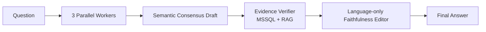

# Hybrid Orchestration

## รุ่นล่าสุด: Hybrid v1 Grounded Consensus

รุ่นแนะนำปัจจุบันของ repository คือ `LAB-hybrid-v1-grounded-consensus-thai` โดยแยกเป็น top-level orchestration line เพราะไม่ได้เป็น Concurrent หรือ Magentic แบบบริสุทธิ์

## ที่มา

- รับ Parallel Workers และ Semantic Consensus จาก Concurrent v4 paper-exact
- รับแนวคิด Evidence Verification จาก Magentic v3
- เพิ่ม MCP isolation ต่อ Worker/Verifier และ Language-only Editor ที่ห้ามเพิ่มหรือคำนวณ claim ใหม่
- ไม่มี rigid JSON contract, key/value parser หรือ fail-closed Guard

## ผลล่าสุด

| Metric | Hybrid v1 rerun2 |
|---|---:|
| Availability | 100.0% first pass |
| Correctness | 84.4% |
| Faithfulness | 96.7% |

## ชุดทดสอบและไฟล์หลัก

Hybrid ใช้ Grounded-18 ชุดกลางเดียวกับ orchestration สายอื่น โดยลิงก์ตรงถึงไฟล์ดังนี้:

| สิ่งที่ต้องการดู | ไฟล์ | รายละเอียด |
|---|---|---|
| คำถามเต็ม 18 ข้อ | [`questions.txt`](../parallel-orchestration/benchmarks/finance-loan-grounded18/questions.txt) | Q1–Q18 ที่ยิงเข้า Langflow ตามลำดับ |
| Ground Truth | [`ground-truth.json`](../parallel-orchestration/benchmarks/finance-loan-grounded18/ground-truth.json) | expected values, grain, formula, boundaries และ forbidden claims |
| เกณฑ์ให้คะแนน | [`rubric.md`](../parallel-orchestration/benchmarks/finance-loan-grounded18/rubric.md) | Correctness/Faithfulness 0–5 และ deterministic evaluation rules |
| SQL สำหรับสร้าง ground | [`ground-queries.sql`](../parallel-orchestration/benchmarks/finance-loan-grounded18/sql/ground-queries.sql) | read-only SQL ที่ใช้ยืนยันค่ามาตรฐาน |
| คำตอบดิบรอบล่าสุด | [`raw-v1-final-rerun2.jsonl`](benchmarks/finance-loan-grounded18/raw-v1-final-rerun2.jsonl) | Final Answer จริงครบ 18 ข้อ พร้อมเวลาในแต่ละข้อ |
| ผลประเมินรายข้อ | [`evaluation-v1-rerun2.md`](benchmarks/finance-loan-grounded18/evaluation-v1-rerun2.md) | คะแนนและเหตุผลราย Q เทียบรอบก่อน |
| คะแนน machine-readable | [`scores-v1-rerun2.json`](benchmarks/finance-loan-grounded18/scores-v1-rerun2.json) | คะแนนรวมและ Correctness/Faithfulness รายข้อ |

การให้คะแนนใช้เฉพาะ **Final Answer จาก Chat Output** เทียบกับ Ground Truth ห้ามใช้คำตอบภายในของ Workers, consensus rate, confidence หรือ hidden reasoning เพิ่มคะแนน

## ไฟล์ใช้งาน

- ไฟล์สำหรับปุ่ม **Upload a flow** ของ Langflow 1.7.3: [`flows/LAB-hybrid-v1-grounded-consensus-thai-ui-upload-20260805.json`](flows/LAB-hybrid-v1-grounded-consensus-thai-ui-upload-20260805.json)
- Builder: [`scripts/build_v1_grounded_consensus.mjs`](scripts/build_v1_grounded_consensus.mjs)
- Langflow project: `NT`
- Flow ID เดิมที่รักษาไว้: `cd488940-5fa4-4567-b5e8-43b26d5643ae`

ไฟล์ `*-ui-upload-20260805.json` มี top-level `id` ใหม่และชื่อ flow ใหม่ ไม่ชนกับตัวที่ติดตั้งอยู่ เพราะหน้า **Upload a flow** ของ Langflow 1.7.3 ต้องการรูปแบบเดียวกับไฟล์ export ซึ่งมี identity ครบ ส่วน `endpoint_name` และ API key ไม่ถูกบันทึกใน JSON

หมายเหตุ: การตรวจเดิมที่สร้าง `LAB-hybrid-v1-grounded-consensus-thai (1)` ID `6963c8cb-2322-40a3-9cf3-1ba81393f657` เป็นการเรียก create-flow API ไม่ใช่ปุ่ม Upload ใน UI จึงไม่ใช้เป็นหลักฐานว่าไฟล์ซึ่งไม่มี `id` รองรับ UI uploader

ตรวจไฟล์ UI รุ่นใหม่กับ `POST /api/v1/flows/upload/` ของ Langflow 1.7.3 แล้วได้ HTTP 201 และติดตั้งใน project `NT` เป็น `LAB-hybrid-v1-grounded-consensus-thai-ui-upload-20260805` ID `d51de503-d566-40d4-8989-4e88ca07c4c8` โดย graph ครบ 19 nodes/24 edges

ชุดคำถาม, ground truth และ frozen rubric ต้นฉบับเก็บไว้ใน Parallel เพียง canonical copy เดียวเพื่อป้องกัน benchmark drift ส่วน directory `benchmarks/` ของ Hybrid เก็บเฉพาะคำถามย่อยสำหรับ retry/smoke, ผลดิบ, คะแนน และ evaluation ของ Hybrid
