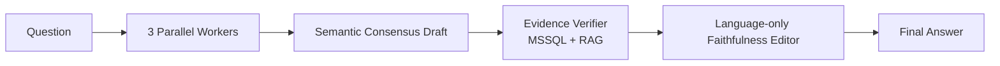

# Hybrid Orchestration

## รุ่นล่าสุด: Hybrid v1 Grounded Consensus

รุ่นแนะนำปัจจุบันของ repository คือ `LAB-hybrid-v1-grounded-consensus-thai` โดยแยกเป็น top-level orchestration line เพราะไม่ได้เป็น Concurrent หรือ Magentic แบบบริสุทธิ์

## ที่มา

- รับ Parallel Workers และ Semantic Consensus จาก Concurrent v4 paper-exact
- รับแนวคิด Evidence Verification จาก Magentic v3
- เพิ่ม MCP isolation ต่อ Worker/Verifier และ Language-only Editor ที่ห้ามเพิ่มหรือคำนวณ claim ใหม่
- ไม่มี rigid JSON contract, key/value parser หรือ fail-closed Guard

## ผลล่าสุด

| Metric | Hybrid v1 rerun2 |
|---|---:|
| Availability | 100.0% first pass |
| Correctness | 84.4% |
| Faithfulness | 96.7% |

ดู [architecture](docs/v1-grounded-consensus.md), [ผล Grounded-18 rerun2 รายข้อ](benchmarks/finance-loan-grounded18/evaluation-v1-rerun2.md) และ [คะแนน JSON](benchmarks/finance-loan-grounded18/scores-v1-rerun2.json)

## ไฟล์ใช้งาน

- Flow: [`flows/LAB-hybrid-v1-grounded-consensus-thai.json`](flows/LAB-hybrid-v1-grounded-consensus-thai.json)
- Builder: [`scripts/build_v1_grounded_consensus.mjs`](scripts/build_v1_grounded_consensus.mjs)
- Langflow project: `NT`
- Flow ID เดิมที่รักษาไว้: `cd488940-5fa4-4567-b5e8-43b26d5643ae`

ชุดคำถาม, ground truth และ frozen rubric ต้นฉบับยังอยู่ที่ [`parallel-orchestration/benchmarks/finance-loan-grounded18/`](../parallel-orchestration/benchmarks/finance-loan-grounded18/) เพื่อให้ทุกสายเทียบกับ canonical benchmark เดียวกัน ส่วน directory `benchmarks/` ที่นี่เก็บเฉพาะคำถามย่อย ผลดิบ คะแนน และ evaluation ของ Hybrid
