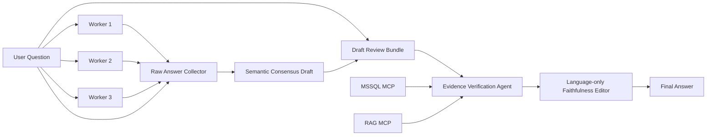

# Hybrid v1: Grounded Consensus

Hybrid v1 รวมจุดแข็งของ Concurrent v4 paper-exact semantic consensus กับแนวคิด Verification Specialist ของ Magentic v3 โดยไม่ใช้ rigid JSON contract หรือ Final Guard แบบ fail-closed

`Raw Answer Collector` และ `Draft Review Bundle` เป็น transport เท่านั้น ไม่ parse, score, validate หรือ reject เนื้อหา

Evidence Verification Agent ตรวจความหมายของ draft กับหลักฐานผ่าน tools แล้วแก้หรือตัด claim ที่ไม่รองรับ โดยยังตอบส่วนที่ตรวจสอบได้ จึงต่างจาก v3 Guard ที่อาจปฏิเสธทั้งคำตอบเมื่อ schema/key ไม่ครบ

Verifier เห็นทั้ง consensus draft และ raw answers ถ้า query ของตนขัดกับ Workers ทั้งสามที่ตรงกัน จะตรวจ schema/grain/formula ซ้ำก่อนแก้ค่า ส่วน Language-only Faithfulness Editor ไม่มี tools และห้ามคำนวณหรือเพิ่ม claim ทำหน้าที่รักษาข้อเท็จจริงและตัด unsupported interpretation จากภาษาสุดท้ายเท่านั้น

เป้าหมายเชิงทดลองคือรักษา correctness gain ของ v4 พร้อมกู้ faithfulness ที่เสียจาก invented currency, unsupported interpretation และ semantic mapping ที่ผิด

## Langflow และสถานะการทดสอบ

- Flow: `LAB-hybrid-v1-grounded-consensus-thai`
- Flow ID: `cd488940-5fa4-4567-b5e8-43b26d5643ae`
- Project: `NT`
- แยก MSSQL/RAG MCP คนละคู่สำหรับ Worker 1–3 และ Verifier เพื่อลด shared-session collision
- จำกัด output ของ Agent แต่ละตัวไว้ที่ 8,192 tokens

Q1 smoke test ผ่านด้วย exact totals/averages และไม่สร้างสกุลเงิน ส่วน Q4 smoke test หลังเพิ่ม Language-only Faithfulness Editor ผ่านทั้ง requested metrics และไม่มี currency/speculation

Grounded-18 รอบก่อนเพิ่ม Final Editor ได้ผลโดยประมาณ correctness 80.0% และ faithfulness 86.7% เมื่อเลือก targeted rerun ล่าสุดแทนข้อที่แก้แล้ว ตัวเลขนี้ใช้สำหรับวินิจฉัย architecture เท่านั้น ไม่ใช่คะแนน final Hybrid v1 ที่ frozen อย่างเป็นทางการ

การทดสอบ final architecture ที่ Q8/Q10/Q11 หยุดด้วย OpenRouter HTTP 402 (`Insufficient credits`) จึงยังห้ามสรุปคะแนนรวมของ final Hybrid v1 ต้องรัน Grounded-18 ใหม่ทั้ง 18 ข้อเมื่อมีเครดิต และเก็บ raw artifact ชุดใหม่โดยไม่ผสมกับรอบก่อนแก้ architecture

การลองรัน Grounded-18 ซ้ำครบ 18 requests ในวันที่ 2026-08-05 ถูก OpenRouter ปฏิเสธด้วย HTTP 402 ทุกข้อก่อน Worker ทำงาน ดู [credit-blocked run](../benchmarks/finance-loan-grounded18/evaluation-v1-final-credit-blocked.md) รอบนี้จึง invalidated และไม่ใช่คะแนน 0 ของ architecture

หลังเครดิตพร้อม รัน final Grounded-18 สำเร็จ 17/18 ข้อใน first pass และกู้ Q15 ซึ่งเป็น transient MCP failure ด้วย targeted retry ผล recovered คือ availability 100.0%, correctness 78.9% และ faithfulness 93.3% ดู [ผล final รายข้อ](../benchmarks/finance-loan-grounded18/evaluation-v1-final.md)

Rerun2 หลังแยกเป็น Hybrid v1 สำเร็จครบ 18/18 ใน first pass โดยไม่ retry ได้ correctness 84.4% และ faithfulness 96.7% ซึ่งเป็นผลล่าสุด ดู [ผล rerun2 รายข้อ](../benchmarks/finance-loan-grounded18/evaluation-v1-rerun2.md)
