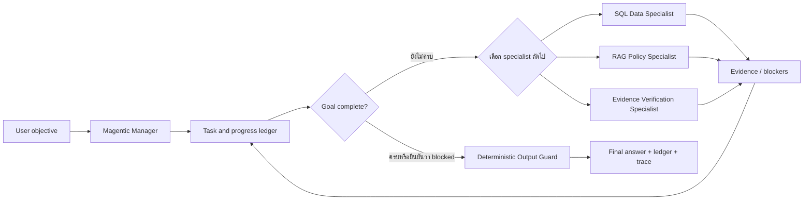

# Magentic Orchestration

ชุดนี้เป็น Langflow implementation ของ **Magentic orchestration** สำหรับปัญหา Finance/Loan แบบซับซ้อนและไม่มีลำดับแก้ปัญหาตายตัว โดยอ้างอิง [Microsoft Learn: AI Agent Orchestration Patterns](https://learn.microsoft.com/en-us/azure/architecture/ai-ml/guide/ai-agent-design-patterns#magentic-orchestration) และ [Semantic Kernel: Magentic Agent Orchestration](https://learn.microsoft.com/en-us/semantic-kernel/frameworks/agent/agent-orchestration/magentic)

> ชื่อที่ถูกต้องคือ **Magentic** ไม่ใช่ `mgentic` ชื่อมาจากแนวคิด Magentic-One

## v1: Finance Research Manager

Flow: [`flows/LAB-magentic-v1-finance-research-thai.json`](flows/LAB-magentic-v1-finance-research-thai.json)



ต่างจาก `parallel-orchestration` อย่างสำคัญ:

| Parallel/Concurrent | Magentic |
|---|---|
| ส่ง task เดียวกันให้ Workers ทำพร้อมกัน | Manager แตก objective เป็น task ledger |
| เส้นทางค่อนข้างคงที่ | Manager เลือก specialist และลำดับแบบ dynamic |
| รวมผลด้วย aggregation/vote | ประเมิน progress แล้ว re-plan เมื่อจำเป็น |
| เหมาะกับหลายมุมมองอิสระ | เหมาะกับงาน open-ended ที่ไม่รู้ solution path ล่วงหน้า |

## Safety profile

v1 เป็น **read-only research profile**: Specialists ใช้ MSSQL และ RAG เพื่อค้นคว้าเท่านั้น ยังไม่เปิดสิทธิ์เปลี่ยน external systems แม้ Magentic pattern จะรองรับ action agents ได้ เพราะการเพิ่ม action ต้องมี approval boundary, idempotency และ rollback design แยกต่างหาก

Manager จำกัดไม่เกิน 10 specialist calls และต้องเรียก Verification Specialist ก่อน final เมื่อคำตอบมีตัวเลขหรือ policy ผลลัพธ์สุดท้ายเปิดเผย `task_ledger`, `claims`, `execution_trace` และ `uncertainties` เพื่อ audit ได้ จากนั้น deterministic Output Guard จะตัด reasoning/Markdown ที่อยู่นอก final JSON และ fail closed หาก schema ไม่ครบ โดยไม่เรียก LLM และไม่เพิ่ม claim ใหม่

## Build

จาก root ของ repository:

```bash
node magentic-orchestration/scripts/build_v1_magentic.mjs
```

จากนั้น upload ไฟล์ JSON ใน `magentic-orchestration/flows/` เข้า Langflow 1.7.3 และตั้ง API key/model ใน Manager กับ Specialists ตาม environment ของคุณ MCP server names ถูกสืบทอดจาก flow v9 คือ `local-mcp-mssql` และ `vpn-rag`

## Benchmark

เริ่มจากคำถาม open-ended ใน [`benchmarks/finance-open-ended/questions.txt`](benchmarks/finance-open-ended/questions.txt) ซึ่งต้องประเมินทั้ง final answer และคุณภาพของ ledger/re-planning ตาม [`rubric.md`](benchmarks/finance-open-ended/rubric.md)

## Current status

- Import เข้า Langflow 1.7.3 โปรเจกต์ NT แล้ว: flow ID `4d5c6b59-027d-467e-b2ec-720d84bf7dcb`
- Structural smoke test ผ่าน: graph build สำเร็จ, Manager ตอบผ่าน deterministic Output Guard และ Chat Output ได้เฉพาะ JSON
- รัน Finance/Loan Grounded-18 แบบ end-to-end แล้วหลังได้รับอนุญาต ผลดิบและ evaluation ถูกบันทึกใน `benchmarks/finance-grounded18/`

### Grounded-18 result

หลังได้รับอนุญาต ได้รัน Finance/Loan Grounded-18 ชุดเดียวกับ Parallel แล้ว ผล v1 คือ transport availability 88.9%, task completion 0%, correctness 0.0% และ faithfulness 86.7% Guard ป้องกัน unsupported claims ได้ แต่ Manager/Specialist path ยังใช้งานจริงไม่ได้ ดู [ผลประเมินรายข้อ](benchmarks/finance-grounded18/evaluation-v1.md)
