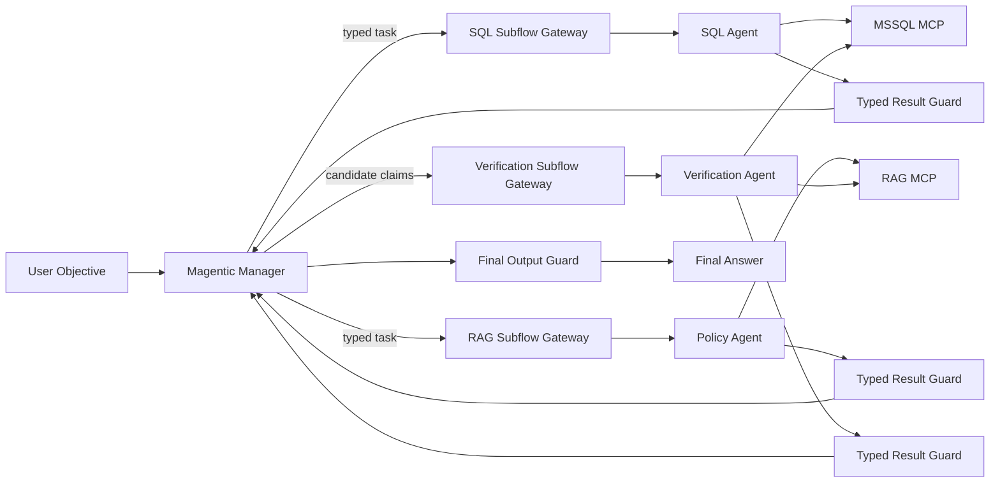

# Magentic v2: Subflow Specialists

v2 แก้ defect `skip_db_update` โดยไม่ใช้ Agent-as-tool และไม่ให้ Manager ทำ specialist task เอง



Manager ไม่มี MCP edge, ไม่สร้าง SQL และไม่คำนวณ business metric ส่วน Subflow Gateway ทำหน้าที่ส่ง task ไปยัง endpoint ของ specialist เท่านั้น

หมายเหตุสำหรับ Langflow 1.7.3: `/api/v1/run/` ต้องใช้ flow UUID; `endpoint_name` ไม่ถูก resolve บน route นี้ Builder จึงบันทึก UUID ของ subflows ที่ import ในโปรเจกต์ NT ไว้ใน Gateway code

Gateway methods และ MCP component IDs ต้องไม่ซ้ำกันข้าม subflow (`run_sql_specialist`, `run_rag_specialist`, `run_verification_specialist`) เพื่อป้องกัน tool-name collision และ MCP session-key collision ใน Langflow runtime

## Files

- `flows/v2/LAB-magentic-v2-sql-specialist-thai.json`
- `flows/v2/LAB-magentic-v2-rag-specialist-thai.json`
- `flows/v2/LAB-magentic-v2-verification-specialist-thai.json`
- `flows/v2/LAB-magentic-v2-subflow-specialists-thai.json`

สร้างใหม่ด้วย:

```bash
node magentic-orchestration/scripts/build_v2_subflows.mjs
```
