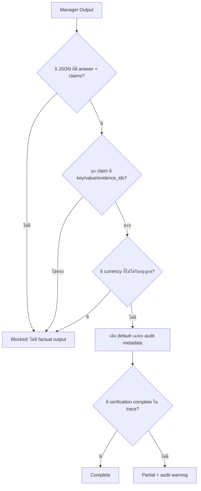

# Magentic v3: Resilient Final Guard

v3 ใช้ SQL, RAG และ Verification subflows ชุดเดียวกับ v2 แต่เปลี่ยน Final Guard จาก schema-strict เป็น **claim-strict, schema-tolerant**

## Critical fields

- `answer`
- `claims`
- แต่ละ claim ต้องมี `key`, `value`, `evidence_ids` ที่ไม่ว่าง
- สกุลเงินในคำตอบ (`$`, `USD`, `บาท`, `THB`, `EUR`, `GBP`, `JPY` และสัญลักษณ์หลัก) ต้องได้รับอนุญาตจากหน่วยใน claim

ขาดหรือผิดแล้ว reject เพราะกระทบ claim integrity

## Repairable audit fields

- `task_ledger`
- `execution_trace`
- `uncertainties`
- `status`
- `answer` ที่เป็น object/array จะแปลงเป็น JSON string โดยไม่เปลี่ยนค่าภายใน

ขาดแล้ว Guard เติม deterministic default และบันทึกใน `audit_warnings` โดยไม่สร้างหรือแก้ factual claim หากไม่มี verification trace จะลดสถานะเป็น `partial`
