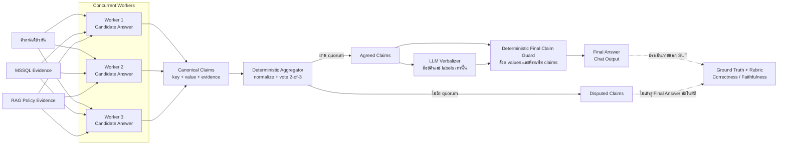

# Parallel Orchestration: Multi-Agent Langflow MCP

## อะไรใหม่สุดในสาย Concurrent

รุ่นล่าสุดของ directory นี้คือ **v9 Canonical Claims** ซึ่ง normalize claims และใช้ deterministic 2-of-3 vote ก่อน LLM verbalizer และ Final Claim Guard ส่วนงานที่ผสม Evidence Verification กับ Language-only Editing ถูกแยกไปเป็น [Hybrid v1](../hybrid-orchestration/) แล้ว

## v4: Paper-exact semantic consensus

`LAB-concurrent-v4-paper-exact-thai` ไม่มี JSON contract, key/value parsing, deterministic vote, Verifier หรือ Final Guard Workers สามตัวตอบคำถามเดียวกันเป็นภาษาธรรมชาติ แล้ว Semantic Consensus Agent อ่านความหมายและสรุปคำตอบสุดท้าย ดู [architecture และ smoke test](docs/v4-paper-exact.md) Flow นี้ถูกติดตั้งใน project `NT` ด้วย ID `ec0c57d5-fca9-4f86-b9a8-8b50207691c0`

ผล Finance/Loan Grounded-18 เทียบ Magentic v3: correctness ดีขึ้นจาก 51.1% เป็น 70.0% แต่ faithfulness ลดจาก 92.2% เป็น 67.8% ดู [ผลเปรียบเทียบรายข้อ](benchmarks/finance-loan-grounded18/evaluation-v4-paper-exact-vs-magentic-v3.md)

ตัวอย่าง Langflow 1.7.3 สำหรับงาน multi-agent แบบ parallel workers และ deterministic vote aggregation พร้อม benchmark ที่ใช้ MSSQL + RAG เป็น ground

Directory นี้เก็บเฉพาะ **Parallel Orchestration** ซึ่งตรงกับชื่อ **Concurrent orchestration** ใน Microsoft Learn: Agents หลายตัวประมวลผล task เดียวกันพร้อมกันอย่างอิสระ ก่อนรวบรวมและ aggregate ผลลัพธ์ ดู [Microsoft Learn: Concurrent orchestration](https://learn.microsoft.com/en-us/agent-framework/workflows/orchestrations/concurrent)

ภาพรวมและความแตกต่างของ v4–v9 อยู่ที่ [docs/flow-versions.md](docs/flow-versions.md)

## โครงสร้าง

```text
flows/
  paper-exact/
    LAB-concurrent-v4-paper-exact-thai.json
  LAB-1-4-withlocal-parallel-consensus-v5-thai.json
  LAB-1-4-withlocal-concurrent-consensus-v6-thai.json
  LAB-1-4-withlocal-concurrent-consensus-v7-financial-loan-thai.json
  LAB-1-4-withlocal-concurrent-consensus-v8-guarded-verbalizer-thai.json
  LAB-1-4-withlocal-concurrent-consensus-v9-canonical-claims-thai.json
benchmarks/customer-service-hard10/
  questions.txt
  ground-truth.md
  evaluation.md
benchmarks/finance-loan-grounded18/
  questions.txt
  ground-truth.json
  rubric.md
  sql/ground-queries.sql
  raw-v7.jsonl
  raw-v8.jsonl
  raw-v9-targeted8.jsonl
  raw-v9-targeted2-rerun.jsonl
  raw-v9.jsonl  # full run ล้มจาก MCP connection; ห้ามใช้คำนวณคะแนน
scripts/
  build_v6_concurrent.mjs
  build_v7_financial_loan.mjs
  build_v8_guarded_verbalizer.mjs
  build_v9_canonical_claims.mjs
  copy_flow_api_keys.py
  sync_flow_design.py
  run_langflow_hard10.py
  inspect_mcp_servers.py
  call_mcp_tool.py
```

## คำศัพท์และความสัมพันธ์ในกระบวนการ

### คำศัพท์หลัก

| คำ | ความหมายในระบบนี้ | ตัวอย่าง |
|---|---|---|
| **Answer** | คำตอบฉบับเต็มที่ Agent หนึ่งตัวสร้างจากคำถาม | คำอธิบายพอร์ตสินเชื่อพร้อมตัวเลขหลายรายการ |
| **Candidate Answer** | Answer ของ Worker แต่ละตัวก่อนรวมผล โดย Workers ทำงานแยกจากกัน | Candidate 1, 2 และ 3 |
| **Claim** | ข้อเท็จจริงย่อยหนึ่งรายการภายใน Answer ประกอบด้วย key และ value | `loan_count = 1432440` |
| **Canonical Claim** | Claim ที่กำหนดชื่อ key, metric, grain, unit และโครงสร้างมาตรฐานไว้ล่วงหน้า เพื่อให้ Workers โหวตค่าเดียวกันได้ | ทุก Worker ต้องใช้ `requested_total` ไม่ใช้ชื่ออื่นที่ความหมายคล้ายกัน |
| **Evidence** | หลักฐานที่รองรับ Claim เช่นผล SQL จาก MSSQL, policy จาก RAG หรือสมมติฐานที่โจทย์กำหนด | `COUNT_BIG(*)` จาก `loans_fact` |
| **Calculation** | สูตรและการแทนค่าที่ใช้สร้าง derived Claim | `portfolio_pct = loan_count / total_count × 100` |
| **Consensus** | ผลที่ Claim key และ value ตรงกันถึงเกณฑ์ที่กำหนด ในระบบนี้ใช้ quorum อย่างน้อย 2 ใน 3 | Workers 1 และ 2 ให้ `loan_count = 1432440` |
| **Agreed Claim** | Claim ที่ผ่าน quorum แล้วและอนุญาตให้เข้าสู่คำตอบสุดท้าย | `loan_count = 1432440`, support 2/3 |
| **Disputed Claim** | Claim ที่มีหลายค่า หรือไม่มีค่าใดได้เสียงถึง quorum | Workers ให้ยอดรวมคนละค่า |
| **Aggregator** | Custom component แบบ deterministic ที่ normalize และนับ consensus ไม่ใช่ LLM | Claim Consensus Aggregator |
| **Verbalizer** | LLM ที่เสนอถ้อยคำหรือ label ภาษาไทย แต่ไม่มีสิทธิ์เปลี่ยนค่าข้อเท็จจริง | เปลี่ยน `loan_count` เป็น “จำนวนสินเชื่อ” |
| **Final Claim Guard** | Component แบบ deterministic ที่ประกอบค่าจาก Agreed Claims และปฏิเสธข้อมูลใหม่จาก LLM | ไม่อนุญาตให้เพิ่ม USD/THB หากไม่มี metadata |
| **Ground Truth** | คำตอบมาตรฐานภายนอก SUT ที่ใช้ประเมิน Final Answer | `benchmarks/finance-loan-grounded18/ground-truth.json` |

### Flow v9: Canonical Claim Consensus

Diagram ต่อไปนี้เป็นกระบวนการของ **v9** โดยเฉพาะ ไม่ใช่ภาพรวมที่ทุก version ใช้เหมือนกันทั้งหมด v9 สืบทอด `LLM Verbalizer` และ `Final Claim Guard` จาก v8 แล้วเพิ่ม `Canonical Claim Contract` เพื่อบังคับให้ Workers ใช้ชื่อ key, metric, grain, unit และโครงสร้างเดียวกันก่อนเข้า deterministic vote



ลำดับในภาพจึงอ่านได้ว่า **Evidence → Candidate Answers → Canonical Claims → 2-of-3 Vote → Agreed Claims → Verbalizer → Final Claim Guard → Final Answer** ส่วน Ground Truth และ Rubric อยู่นอก SUT และใช้ประเมินคำตอบภายหลัง

ตัวอย่างการโหวต Claim:

```text
Worker 1: loan_count = 1,432,440
Worker 2: loan_count = 1,432,440
Worker 3: loan_count = 1,432,441
                          │
                          └─ 2-of-3 consensus
                             Agreed Claim: loan_count = 1,432,440
```

ชื่อ key เป็นส่วนหนึ่งของการโหวตด้วย หาก Workers ใช้ `loan_count`, `total_loans` และ `portfolio_size` แม้ value เท่ากัน Aggregator อาจมองเป็นคนละ Claim นี่คือเหตุผลที่ v9 เพิ่ม Canonical Claim Contract ก่อน vote

## Flow v6: Concurrent Full-Answer Consensus

v6 เป็น flow หลักที่นำแนวคิดจากบทความ [การแก้ปัญหาคำตอบที่ไม่คงเส้นคงวาของ Agent ด้วย Multi-Agent with Concurrent Orchestration](https://aekanunbigdata.medium.com/การแก้ปัญหาคำตอบที่ไม่คงเส้นคงวาของ-agent-ด้วย-multi-agent-with-concurrent-orchestration-bfe6e0b7a96f) มาประยุกต์ใช้:

```text
คำถามเดียวกัน
  ├─ Concurrent Full-Answer Agent 1 ─┐
  ├─ Concurrent Full-Answer Agent 2 ─┼─ Concurrent Answer Consensus ─ Final Answer Synthesizer
  └─ Concurrent Full-Answer Agent 3 ─┘
```

- Agents ทั้งสามได้รับคำถาม, tools และ instructions เหมือนกัน
- แต่ละ Agent สร้างคำตอบฉบับเต็มพร้อม structured claims, calculations, evidence และ uncertainties
- Aggregator เปรียบเทียบค่าของ claims ไม่ได้นับ `notify/do_not_notify/abstain`
- Final Synthesizer ตอบจาก claims ที่ตรงกันอย่างน้อย 2 ใน 3 และพิจารณาหลักฐานเมื่อคำตอบต่างกัน
- Final Synthesizer ไม่มี MCP/tool edge และทำ external action ไม่ได้

ความสอดคล้องกับบทความอยู่ที่การส่ง task เดียวกันให้ Agents หลายตัวทำงานอย่างอิสระพร้อมกัน แล้วรวมหลายคำตอบเพื่อลดผลกระทบจาก non-determinism ส่วน structured claims, deterministic 2-of-3 threshold และ Final Synthesizer เป็นรายละเอียด implementation ที่เพิ่มใน v6

รายละเอียดอยู่ใน [docs/v6-concurrent-orchestration.md](docs/v6-concurrent-orchestration.md)

## Flow v5 (legacy vote-based)

Flow ประกอบด้วย worker อิสระ 3 ตัว:

1. Policy worker — ตรวจนโยบายและเงื่อนไขสิทธิ์
2. Evidence worker — ตรวจข้อมูล MSSQL และคุณภาพหลักฐาน
3. Risk worker — ตรวจความขัดแย้ง ข้อมูลขาด และความเสี่ยง

ผลจาก workers ถูกส่งเข้า deterministic vote aggregator ก่อนส่งให้ executor สรุปเป็นภาษาไทย

v5 เก็บไว้เพื่อเปรียบเทียบเท่านั้น เพราะ vote schema แบบ notification ไม่ตรงกับ analytical QA benchmark

ไฟล์ flow ไม่บันทึก API key ผู้ใช้ต้องตั้งค่า key หลัง import หรือผ่าน environment/secret ของ Langflow เอง

## MCP endpoints

ค่าที่ออกแบบไว้สำหรับ Langflow ใน Docker:

```text
MSSQL: http://host.docker.internal:9000/mcp
RAG:   http://host.docker.internal:8000/mcp
```

URL ต้องลงท้ายด้วย `/mcp`

เครื่องมือ benchmark ใช้ MCP แบบ read-only สำหรับค้นคว้าและสร้าง ground truth ไม่ควรเรียกเครื่องมือเพิ่ม/แก้ไขข้อมูลระหว่าง evaluation

## Hard-10 benchmark

ชุดทดสอบ customer service มี 10 ข้อ ครอบคลุม:

- return eligibility และ warranty route
- financial exposure และลำดับความสำคัญ
- SLA/RMA และ refund timeline
- data minimization ตาม PDPA
- ความขัดแย้งของข้อมูลและ business assumptions

ไฟล์ `questions.txt` ใช้ยิงเข้า flow ส่วน `ground-truth.md` มีคำตอบ เหตุผล SQL และ RAG grounds สำหรับตรวจซ้ำ

## Evaluation rule

Correctness ตรวจเฉพาะ **final answer จาก Chat Output** เทียบกับ ground truth เท่านั้น:

- ไม่นำคำตอบราย worker มาคิด
- ไม่นำ vote หรือ consensus rate มาช่วยเพิ่มคะแนน
- ไม่นำ hidden reasoning หรือข้อความก่อน final มาช่วยเพิ่มคะแนน
- timeout นับเป็น execution failure และเป็นศูนย์ในคะแนน end-to-end

Faithfulness ตรวจว่าข้อสรุปใน final answer มีหลักฐานจากโจทย์ MSSQL หรือ RAG รองรับ และไม่มีการแต่งค่าเพิ่ม

ผล clean SUT run ล่าสุด (ไม่มี prompt/parameter override):

- Availability: 10/10 = 100%
- Correctness: 22/50 = 44.0%
- Faithfulness: 34/50 = 68.0%

ดูรายละเอียดรายข้อใน [evaluation.md](benchmarks/customer-service-hard10/evaluation.md)

ผล v6 Concurrent Full-Answer ล่าสุด:

- Availability: 10/10 = 100%
- Correctness: 28/50 = 56.0%
- Faithfulness: 36/50 = 72.0%
- Correctness ดีขึ้นจาก v5 จำนวน 12 จุด แต่ latency เฉลี่ยเพิ่มจาก 43.2 เป็น 61.9 วินาที

ดู [evaluation-v6.md](benchmarks/customer-service-hard10/evaluation-v6.md)

## Flow v7: Financial & Loan specialization

v7 คง concurrent full-answer 3 agents และ deterministic 2-of-3 claim consensus ของ v6 แต่เพิ่ม data contract สำหรับ `loans_fact`, dimension joins, rate/percent normalization, DTI policy grounding และ data-quality guardrails สำหรับงานวิเคราะห์สินเชื่อ รายละเอียดอยู่ใน [docs/v7-financial-loan.md](docs/v7-financial-loan.md)

ผล Finance/Loan Grounded-18: availability 100%, correctness 81.1%, faithfulness 51.1% และพบ reasoning leakage 18/18 ข้อ ดู [evaluation-v7.md](benchmarks/finance-loan-grounded18/evaluation-v7.md)

## Flow v8: Guarded verbalizer

v8 ให้ LLM ทำหน้าที่เสนอถ้อยคำและ label ภาษาไทยเท่านั้น จากนั้น deterministic Final Claim Guard จะประกอบค่าจริงจาก `agreed_claims` และปฏิเสธข้อความที่เพิ่มตัวเลข หน่วย สกุลเงิน policy หรือ claim ใหม่ รายละเอียดอยู่ใน [docs/v8-guarded-verbalizer.md](docs/v8-guarded-verbalizer.md)

ผล Grounded-18 ของ v8: availability 88.9%, correctness 37.8%, faithfulness 85.6%, reasoning leakage 0/18 และ invented currency 0/18 ดู [evaluation-v8.md](benchmarks/finance-loan-grounded18/evaluation-v8.md)

### v7 เทียบกับ v8

| Metric | v7 | v8 | ผลที่เห็น |
|---|---:|---:|---|
| Availability | 100% | 88.9% | v7 จบงานครบกว่า |
| Correctness | 81.1% | 37.8% | v7 ตอบครบและตรง ground มากกว่า |
| Faithfulness | 51.1% | 85.6% | v8 ลด claims ที่ไม่มีหลักฐาน |
| Reasoning leakage | 18/18 | 0/18 | v8 ปิด leakage ได้ทั้งหมด |
| Invented currency | พบหลายข้อ | 0/18 | v8 ป้องกันได้ทั้งหมด |
| Average latency | 56.70s | 83.12s | v8 ช้ากว่าและ timeout 2 ข้อ |

สถานะปัจจุบัน:

- ใช้ **v7** เป็น baseline ด้าน answer completeness/correctness แต่ยังไม่ควรเชื่อ claims ที่ Final Synthesizer เพิ่มเอง
- ใช้ **v8** เป็น safety architecture reference เพราะ Final Claim Guard ทำงานตามเป้าหมาย แต่ยังไม่ใช่รุ่นแนะนำสำหรับ production QA เนื่องจากคำตอบไม่ครบ
- งานถัดไปคือกำหนด canonical claim schema ต่อ financial intent ให้ workers ทั้งสามใช้ key, metric, grain และ unit เดียวกันก่อน vote โดยไม่ผ่อน deterministic guard

## Flow v9: Canonical finance claims

v9 รักษา Final Claim Guard ของ v8 และเพิ่ม canonical claim schema สำหรับ 10 Finance/Loan contracts, alias normalization, precision-safe SQL และ raw-DTI semantics เพื่อเพิ่ม completeness โดยไม่คืนอำนาจสร้างข้อเท็จจริงให้ Final LLM รายละเอียดอยู่ใน [docs/v9-canonical-claims.md](docs/v9-canonical-claims.md)

สถานะ: implemented และ import เข้าโปรเจกต์ NT แล้ว การทดสอบ targeted 8 ข้อบันทึกใน `raw-v9-targeted8.jsonl` และ rerun 2 ข้อบันทึกใน `raw-v9-targeted2-rerun.jsonl` ส่วน `raw-v9.jsonl` เป็น full run ที่ล้มจาก MCP connection ทั้งชุด จึงเก็บไว้เป็นหลักฐานด้าน infrastructure และห้ามนำไปคำนวณคะแนนคุณภาพของ v9

ผล safe-mode รอบแรกถูก invalidated และเก็บเพื่อ audit ไว้ใน `evaluation-safe-mode-invalidated.md`

## Run benchmark

เริ่มจาก root ของ repository แล้วเข้า directory นี้ก่อน เพื่อให้ path เริ่มต้นของ builder และ benchmark scripts ทำงานตรงกัน:

```bash
cd parallel-orchestration
```

Langflow ต้องทำงานที่ `http://localhost:7860` และมี flow ID ตรงกับค่าที่ตั้งในสคริปต์:

```bash
python3 scripts/run_langflow_hard10.py benchmarks/customer-service-hard10/questions.txt
```

ระบุ flow อื่น เช่น v6 ผ่าน environment variable:

```bash
LANGFLOW_FLOW_ID=<flow-id> python3 scripts/run_langflow_hard10.py benchmarks/customer-service-hard10/questions.txt
```

สคริปต์สร้าง session ใหม่ต่อคำถามหนึ่งข้อเพื่อไม่ให้คำตอบก่อนหน้ารั่วข้ามข้อ และไม่ส่ง `tweaks` ใด ๆ ไปเปลี่ยน flow ดังนั้นคำตอบมาจาก SUT ที่ import อยู่ใน Langflow โดยตรง

> คำเตือน: runner เรียก flow เดิมแบบ end-to-end หาก Executor ของ flow มีสิทธิ์เรียกเครื่องมือที่เปลี่ยนแปลงข้อมูล ผู้ทดสอบต้องจัด MCP แบบ read-only หรือ test doubles ที่ชั้น environment โดยห้ามแก้ prompt/parameters ของ SUT ระหว่างการประเมิน

## Security

- ห้าม commit API keys, database passwords หรือ bearer tokens
- ตรวจ flow export ทุกครั้งก่อน commit เพราะ Langflow บาง configuration อาจ export secret ติดมาด้วย
- ชุดข้อมูลต้นทางอาจมี PII; ควรใช้เฉพาะใน environment ที่ได้รับอนุญาต
