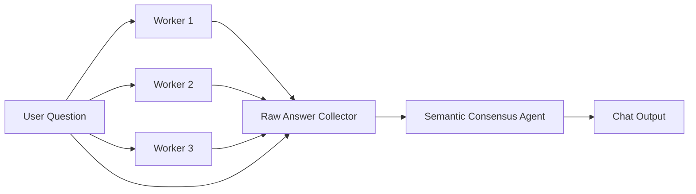

# Concurrent v4: Paper Exact

Implementation นี้ยึดแนวทางในบทความ [การแก้ปัญหาคำตอบที่ไม่คงเส้นคงวาของ Agent ด้วย Multi-Agent with Concurrent Orchestration](https://aekanunbigdata.medium.com/การแก้ปัญหาคำตอบที่ไม่คงเส้นคงวาของ-agent-ด้วย-multi-agent-with-concurrent-orchestration-bfe6e0b7a96f) โดยไม่เพิ่ม contract หรือ guard จากรุ่นทดลองภายหลัง

`Raw Answer Collector` เป็นเพียง transport adapter ที่ต่อข้อความดิบเข้าด้วยกัน ไม่ parse, vote, validate หรือเปลี่ยนคำตอบ

ไม่มี JSON schema, output contract, key/value/claim parsing, deterministic vote, canonicalization, typed results, Verification Specialist, Final Guard, Manager, task ledger หรือ re-plan

Workers ตอบอย่างอิสระเป็นภาษาธรรมชาติ ส่วน Semantic Consensus Agent อ่านความหมายของคำตอบทั้งสามและสร้าง Final Answer โดยตรง

## Langflow และ smoke test

- Langflow flow ID: `ec0c57d5-fca9-4f86-b9a8-8b50207691c0`
- ชื่อ flow: `LAB-concurrent-v4-paper-exact-thai`
- ติดตั้งใน project `NT`
- ไฟล์สำหรับ import: `flows/paper-exact/LAB-concurrent-v4-paper-exact-thai.json`

ทดสอบด้วยคำถามหาจำนวนสินเชื่อ ผลรวม `loan_amnt`/`funded_amnt` และค่าเฉลี่ยต่อรายการ ผลจาก Workers ทั้งสามตรงกัน และ Final Answer ตอบว่า 1,432,440 รายการ, `loan_amnt` รวม 22,017,160,000, `funded_amnt` รวม 22,017,130,000, ค่าเฉลี่ย 15,370.39 และ 15,370.37 ตามลำดับ โดยไม่สร้างสกุลเงินขึ้นเอง

Semantic Consensus Agent ปิด reasoning output ผ่านพารามิเตอร์ของโมเดล เพื่อไม่ให้ hidden reasoning ปรากฏแก่ผู้ใช้ การตั้งค่านี้ไม่ได้ parse, แก้ไข, validate หรือคัดทิ้งคำตอบหลังโมเดลสร้างผล จึงไม่ใช่ Final Guard หรือ output contract
